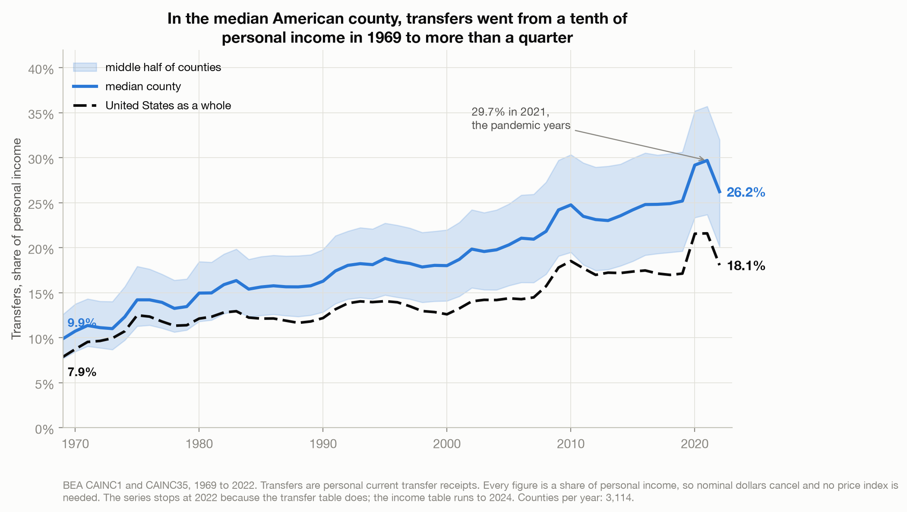
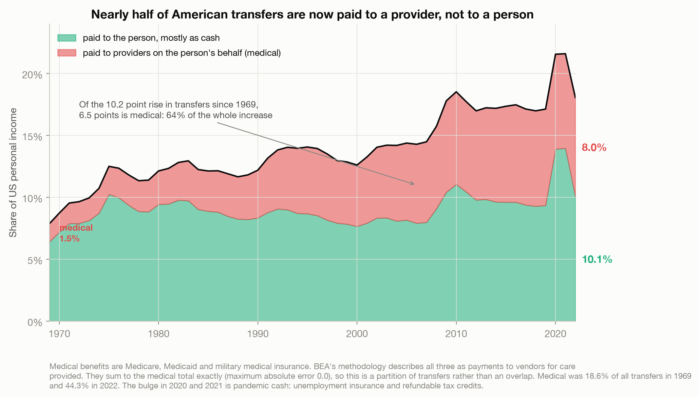
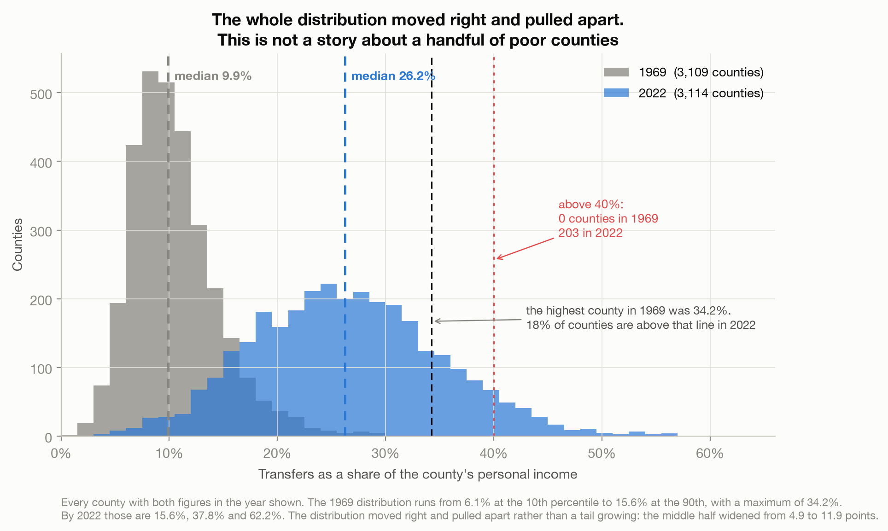
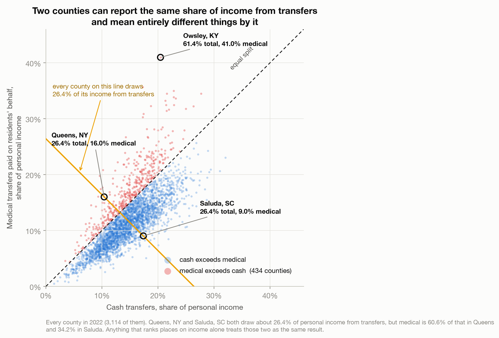

# A Quarter of the Median County's Income Is a Transfer. Nearly Half of That Is Paid to a Provider.

> BEA defines personal income as the income received "by, or on behalf of, all persons". Everyone
> quoting a county income figure says the first half. In the median American county, transfers are
> now 26.2% of personal income, and 43.5% of those are medical benefits paid to hospitals and
> insurers rather than handed to the people they are attributed to.

A data story about what is inside a number that gets used to rank places. Built entirely on BEA's
county tables, with nothing joined from anywhere else. Found via Data Is Plural, 2021-12-01. See
[`data/README.md`](data/README.md).

Live essay: [A Quarter of the Median County's Income Is a Transfer](https://joechrisnaldy.com/blog/a-quarter-of-county-income-is-a-transfer).

---

## The argument in four charts

**Transfers went from a tenth of the median county's income to more than a quarter.** Nationally 7.9%
in 1969 to 18.1% in 2022; in the median county 9.9% to 26.2%. Those differ mostly because of size rather
than wealth: the unweighted average county is 26.4%, weighting that average by population takes it to
19.9%, and weighting by income takes it to 18.1%, so the population step is 79% of the gap. All three
rungs are means, deliberately, because the income-weighted mean is exactly the national headline.
Wealth matters too, with transfer
share falling as counties get richer (-0.671 on levels, -0.774 on logs, -0.807 on ranks).
Los Angeles County is at 19.2%, Harris County at 13.0%. The 2021 spike to 29.7% is pandemic
unemployment insurance and refundable tax credits, and it had unwound by 2022.



**Nearly half of it is paid to a provider.** Medical benefits, which BEA's methodology
describes as payments to vendors, go to providers rather than to beneficiaries. They were 1.5% of US personal income and 18.6%
of transfers in 1969; by 2022 they were 8.0% and **44.3%**. Of the 10.2-point rise in transfers,
**6.5 points is medical, 64% of the whole increase**. Income maintenance, the bucket the politics is
argued over, moved 1.1 points in 53 years.



**The whole distribution moved right and pulled apart.** In 1969 the most transfer-dependent county
in America was at 34.2%. By 2022, **18% of all counties were above that line** and 203 were above
40%, a level no county reached in 1969. The 10th percentile rose 9.6 points, the median 16.4 and the
90th 22.2, so the spread more than doubled while every part of it climbed.



**Two counties can report the same number and mean different things.** Queens, New York and Saluda,
South Carolina both draw about 26.4% of personal income from transfers. Medical is 60.6% of that in
Queens and 34.2% in Saluda. In **434 counties the money paid on residents' behalf exceeds everything
else in the transfer total** (644 counting only government transfers), against none in 1969, and in
169 counties medical alone exceeds a fifth of all personal income.



---

## How the analysis works

| Step | Script | What it does |
|------|--------|--------------|
| 1. Analyze | [`build_analysis.py`](build_analysis.py) | Reads only the `_ALL_AREAS_` files, proves all three traps from the data, cuts at 2022, builds the national and county-level series, decomposes transfer growth benefit by benefit, partitions cash against medical, computes the distribution shift and the weighting effect, and writes `results.json`. |
| 2. Charts | [`make_charts.py`](make_charts.py) | The four figures above. Every figure that comes out of the data is interpolated from `results.json`; the only typed numbers are chosen thresholds and layout coordinates. |

## Reproduce it

```bash
python3 -m venv .venv && source .venv/bin/activate
pip install -r ../requirements.txt
# download the two BEA tables, see data/README.md
python build_analysis.py                      # writes results.json
python make_charts.py                         # writes charts/*.png
```

## Method and caveats

**Three traps and one late wrinkle, all in the packaging rather than the data.**

| Trap | What it does if ignored | Handling |
|---|---|---|
| `CAINC1.zip` contains 52 per-area files **and** an `_ALL_AREAS_` file | a glob matches both and doubles every row | read only `_ALL_AREAS_`; the script asserts zero duplicate GeoFIPS and LineCode pairs |
| Connecticut's 8 counties end in 2023 and 9 planning regions begin in 2024; 25 of Alaska's 55 units stop before 2024 | the county count looks stable at ~3,110 because 8 leave as 9 arrive | balanced panel reported explicitly: 3,089 counties unbroken 1969 to 2023 |
| Each CSV ends with four trailer rows whose `GeoFIPS` cell holds prose | a `~endswith("000")` filter lets them through and reports 3,153 counties instead of 3,149 | require `GeoFIPS.str.fullmatch(r"\d{5}")` |
| CAINC1 ends 2024, CAINC35 ends 2022 | a silent two-year mismatch between numerator and denominator | everything cut at 2022 |

**No deflator, deliberately.** Every headline is a share of personal income, so nominal dollars cancel
and no price index is needed. Dollar levels appear nowhere in the argument.

**Per capita personal income is a derived ratio**, exactly personal income divided by population to
the rounded dollar. Not measured. Barely used here, but it is the figure most often quoted from this
dataset.

**The medical partition is exact.** Line 2200 equals 2210 plus 2220 plus 2230 with maximum absolute
error 0.0, so cash against on-behalf-of is a real partition and not an overlap.

**Median of ratios, not ratio of medians.** The title's second clause is the median of each county's
own medical-to-transfers ratio, 43.54%. The ratio of the two medians is 43.58% and the national
aggregate is 44.26%. They agree here, which is luck rather than a law, and all three are computed.
Relatedly, the median transfer, medical and cash shares do not sum (11.44 plus 14.50 is 25.94 against
26.24), because they are three different rankings of the same counties.

**"Transfers" is the full total, not government only.** Government transfers alone are 7.29% of
personal income in 1969 and 17.37% in 2022, against 7.88% and 18.07% for the total; government is
92.6% and 96.1% of it. The post says so and does not use the word "government" for the headline.

**Counties are not households.** A county's transfer share is an aggregate over all its personal
income, not the budget of a typical family in it.

**One explanation left untested.** High Medicare receipts plausibly reflect an older population, but
there is no age variable in these files and no Census data was joined, so that stays an untested
explanation rather than a finding.

**The non-medical residual is not all spendable cash.** About 13% of it nationally is food stamps,
education and training assistance, and receipts of nonprofit institutions. An earlier version said a
sixth, because it also counted line 4000, transfer receipts of individuals *from* businesses, which
BEA defines as mostly personal injury liability payments to individuals. That is money handed to a
person, so it does not belong on the list. Line 3000, receipts of nonprofit institutions, is the one
that does. The post states the 13% at the point where the split is used, and chart 2 labels the band
"paid to the person, mostly as cash" rather than just "cash".

**The weighting ladder is one statistic under three weights.** 26.4%, 19.9% and 18.1% are the
unweighted, population-weighted and income-weighted *mean*. An earlier version called the first rung
"the median", which swapped estimators mid-sentence. The genuine weighted medians, both computed in
`build_analysis.py`, are 19.2% and 17.0%, and on that ladder the population step is 77%.

**This is not a takedown of BEA.** The definition opens the published methodology, in its second
paragraph; the vendor-payment language is in the benefit-by-benefit method paragraphs and the table
footnotes; and the file that lets anyone take the number apart is
a free download. Every figure here came out of documents the agency published to be read. The
argument is about what survives the trip from those documents into use.
