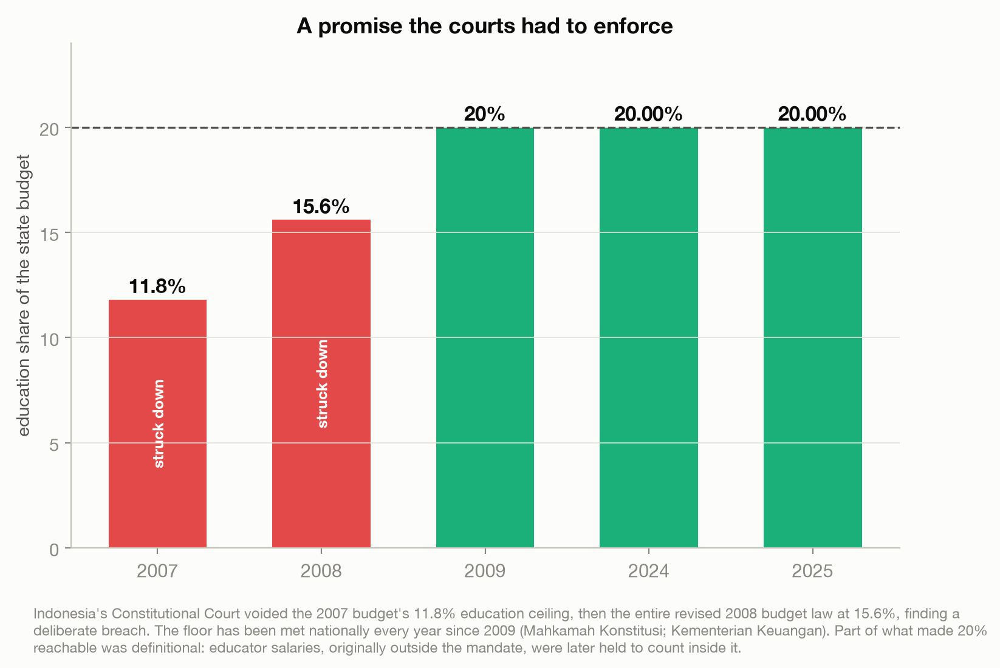
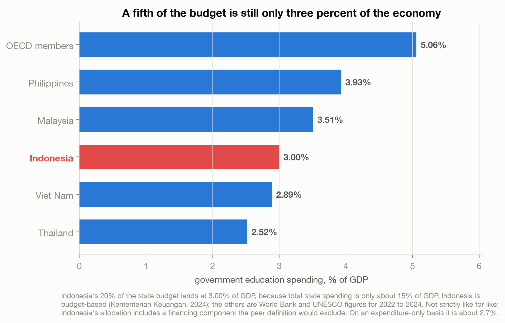
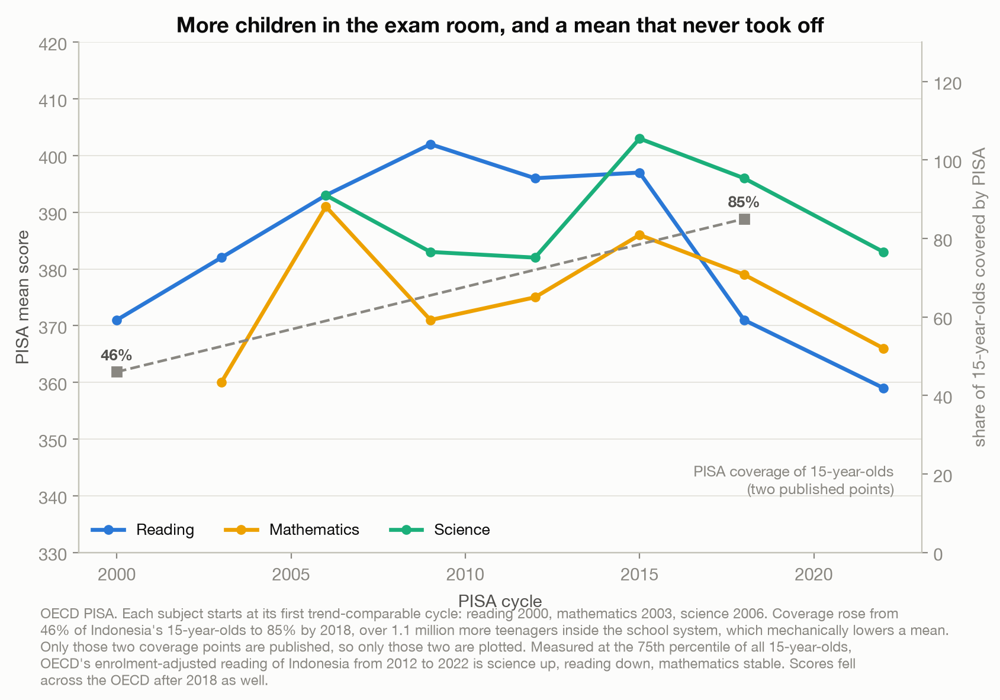
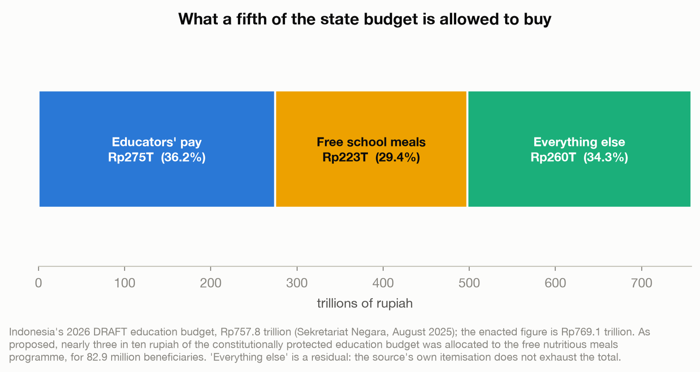

# The Easiest Promise to Keep Is the One You Can Count

> Indonesia wrote an education spending share into its constitution, fought for it in court, and has
> met it every year since 2009. The money is guaranteed. The learning is not.

A data story about what a percentage can and cannot promise. Objective and descriptive, not policy
advocacy. Built entirely from primary sources: Constitutional Court rulings, Ministry of Finance
budget documents, OECD PISA, UNESCO, and the World Bank. No Kaggle dataset, see
[`data/README.md`](data/README.md) for why.

Live essay: [The Easiest Promise to Keep Is the One You Can Count](https://joechrisnaldy.com/blog/the-easiest-promise-to-keep-is-the-one-you-can-count).

---

## The argument in four charts

**A promise the courts had to enforce.** The 2002 constitutional amendment gave education at least
20% of the state budget. The Constitutional Court voided the 2007 budget's 11.8% ceiling, then voided
the entire revised 2008 budget law at 15.6%, finding a deliberate breach. The floor has been met
every year since 2009.



**A fifth of the budget is still three percent of the economy.** Total state spending is only about
15% of GDP, so the world-leading-sounding 20% lands at 3.00% of GDP, below Malaysia and the
Philippines and well below the OECD average. Indonesia's tax take, 12.0% of GDP, has not moved in
sixteen years.



**More children in the exam room.** PISA coverage of Indonesian 15-year-olds rose from 46% to 85%,
over 1.1 million additional teenagers inside the school system. Mean scores never took off, but the
OECD's own enrolment-adjusted reading of 2012 to 2022 is science up, reading down, maths stable, and
it attributes the decline to integrating previously excluded students rather than to schools getting
worse.



**What the share is allowed to buy.** In the 2026 draft budget, educators' pay took 36.2% of the
education budget and the free nutritious meals programme took 29.4%.



---

## How the analysis works

| Step | Script | What it does |
|------|--------|--------------|
| 1. Analyze | [`build_analysis.py`](build_analysis.py) | Holds every verified constant with its source in one auditable place, derives only honest arithmetic (the 20%-of-a-small-budget reconciliation, budget composition shares), prints full tables, writes `results.json`. |
| 2. Charts | [`make_charts.py`](make_charts.py) | The four figures above. |

## Reproduce it

```bash
python3 -m venv .venv && source .venv/bin/activate
pip install -r ../requirements.txt          # matplotlib, numpy
python build_analysis.py                     # writes results.json
python make_charts.py                         # writes charts/*.png
```

## Method and caveats

Full design and sources are in [`docs/`](docs/). Three caveats matter and appear in the essay itself.
PISA trends are only comparable from reading 2000, mathematics 2003 and science 2006. Scores fell
across the OECD between 2018 and 2022, and the OECD says that fall is only partially attributable to
COVID. Most importantly, rapid enrolment expansion mechanically lowers a mean score, so the naive
reading that spending rose while results fell is not supportable and is not made here. Indonesia
spends about USD 19,700 cumulatively per student against the roughly USD 75,000 level past which
more money stops predicting higher scores, so this is a story about a guaranteed share never becoming
a sufficient amount, not a claim that education spending does not work.
