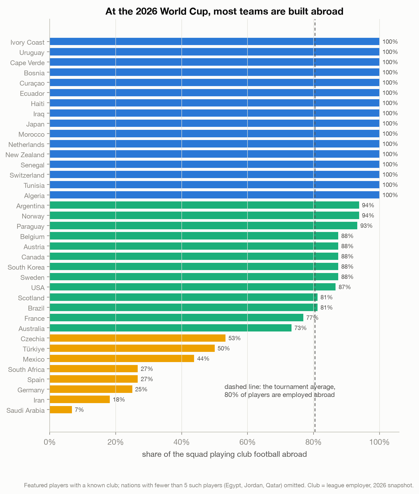
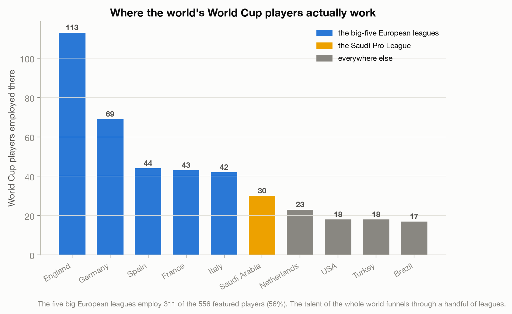
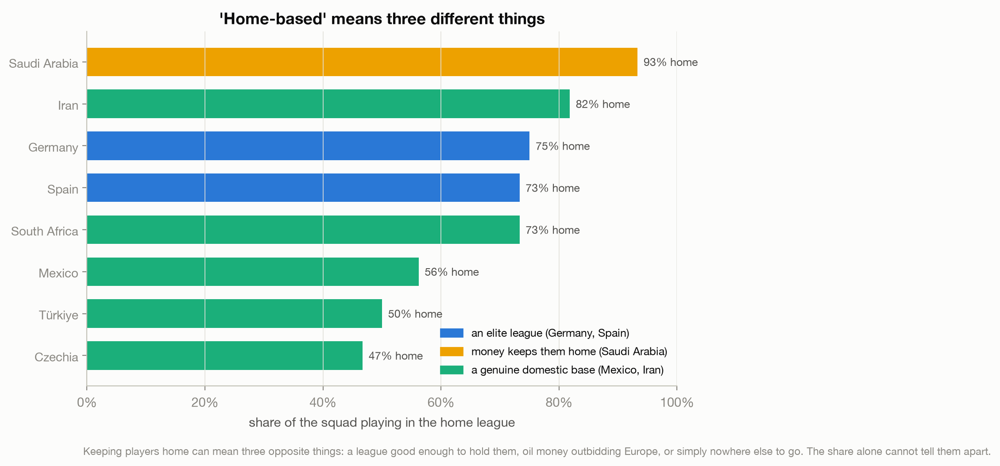

# Nobody Builds a World Cup Team at Home Anymore

> Indonesia missed the 2026 World Cup with a squad mostly born in the Netherlands, and half
> the country argued about whether that team was really theirs. So I counted where every
> qualifier's players actually work. Four in five play abroad. Indonesia was not breaking
> the rules of the modern game; it was finally playing by them.

A data story about the 2026 FIFA World Cup, framed by the tournament Indonesia just missed.
Live essay: [Nobody Builds a World Cup Team at Home Anymore](https://joechrisnaldy.com/blog/nobody-builds-a-world-cup-team-at-home-anymore).

Data: [FIFA match, player and team dataset 2026](https://www.kaggle.com/datasets/wasiqaliyasir/fifa-match-player-and-team-dataset-2026)
(wasiqaliyasir), an early snapshot: 40 of the 48 qualified teams, 1,035 squad players.

---

## The story in three charts

**Four in five play abroad.** Across the 40 qualifiers, 80% of the players who have featured
play their club football outside the country they represent. Of the 37 nations with enough
club data, 16 are built entirely abroad. Indonesia's naturalized, Europe-based squad was not
an aberration; it was the norm.



**And "abroad" means Europe.** The English leagues alone employ 113 of these players; the big
five European leagues employ 311 of 556, about 56%. The world's talent funnels through a
handful of leagues, plus a richer new entrant in Saudi Arabia.



**But the number hides its own meaning.** A club tells you where a player is employed, not
where he was made. The Netherlands and Indonesia would both read near 100% abroad, but one
exports home-grown talent and the other imports it. And "home-based" means three opposite
things: Saudi money, elite leagues, or simply fewer foreign suitors.



The transferable point: a descriptive share can be true and still mislead, because it
measures a destination, not a process. "Built abroad" is a seat at the modern game. It is not
the same as a pipeline that keeps you there.

---

## How the analysis works

| Step | Script | What it does |
|------|--------|--------------|
| 1. Profile | [`profile_data.py`](profile_data.py) | Shapes, club coverage, the distinct-club list. |
| 2. Map clubs | [`build_club_country.py`](build_club_country.py) | Maps each of the 234 clubs to its league country (normalized join; unmapped clubs are reported, never dropped). Writes [`club_country.csv`](club_country.csv). |
| 3. Analyze | [`build_analysis.py`](build_analysis.py) | Foreign-based share per nation (club country vs national-team country, reconciled), league concentration. Writes `results.json`. |
| 4. Charts | [`make_charts.py`](make_charts.py) | The three figures above. |

Foreign-based means the country of a player's club league differs from the country he
represents; the league's country is used, so a Monaco player counts as France. The share is
computed over players who have featured and whose club is recorded (556 of 627); three
nations with fewer than five such players (Egypt, Jordan, Qatar) are omitted from the
ranking.

## Reproduce it

```bash
python3 -m venv .venv && source .venv/bin/activate
pip install -r ../requirements.txt          # pandas, numpy, matplotlib
# download the data into data/ (see data/README.md)
python build_club_country.py                # writes club_country.csv
python build_analysis.py                    # writes results.json
python make_charts.py                       # writes charts/*.png
```

## Method and caveats

Full design and plan notes are in [`docs/`](docs/). In short: `club` is employment, not
development, so the analysis cannot distinguish a nation that grows and exports talent from
one that imports and naturalizes it; the dataset is an early snapshot missing 8 of the 48
teams; the featured-only sample likely nudges the 80% a little high; and Indonesia is not in
the dataset, so every statement about Indonesia is context, not a measurement.
