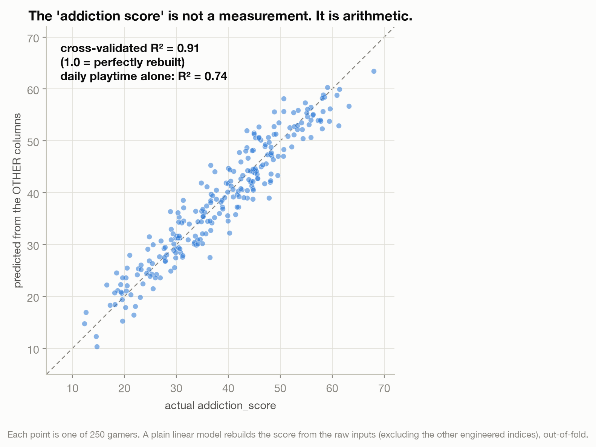
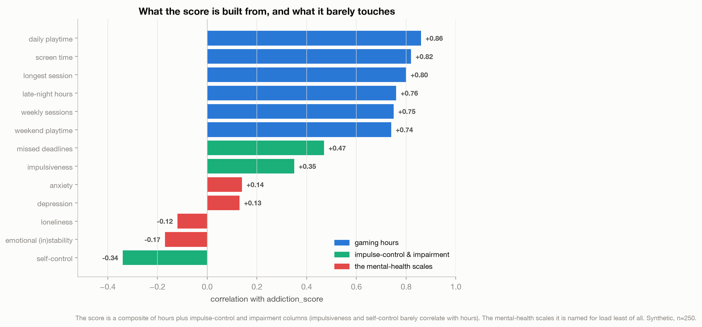
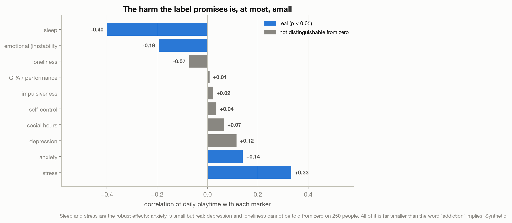
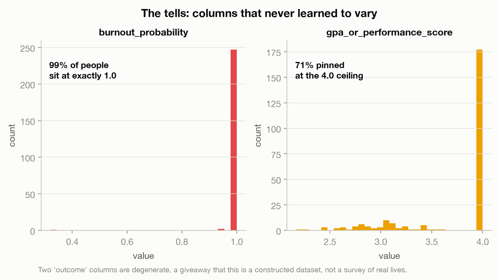

# The Dataset That Already Knew the Answer

> A dataset promises to reveal when gaming tips into an addiction that wrecks your mental health. Its headline "addiction score" turns out to be built from the very columns you would use to explain it, and the mental-health harm in its title barely shows up.

This is a data story about a Kaggle dataset, [Gaming Addiction and Mental Health Analysis](https://www.kaggle.com/datasets/dreamtensor/gaming-addiction-and-mental-health-analysis) (250 gamers, 49 columns). It looks like proof that gaming addiction is real, measurable, and harmful. It is really a lesson about circular targets: outcomes quietly assembled from their own inputs, so any analysis just recovers the recipe.

*(The blog essay is in progress; this README carries the full argument.)*

---

## The story in four charts

**The "addiction score" is not a measurement. It is arithmetic.** A plain linear model, cross-validated, rebuilds the score from the raw columns at R² = 0.91. Daily playtime alone gets to 0.74.



**And it is a plausible composite, which is what makes it dangerous.** The score leans on gaming hours (0.74 to 0.86), but also on impulse-control and impairment columns (impulsiveness and self-control, which barely correlate with hours, and missed deadlines at 0.47). Time plus poor impulse control plus life falling behind is roughly what clinicians mean by a behavioral addiction. The mental-health scales the dataset is named for load least of all.



**The harm the label promises is, at most, small.** Daily playtime relates to sleep (−0.40) and stress (0.33) clearly, to anxiety and emotional steadiness weakly but really, and to depression and loneliness not at all on 250 people. All far smaller than the word "addiction" implies. (This is a fact about this synthetic dataset, not evidence that gaming is harmless; real research on the broader question also finds small effects.)



**The tells.** Two "outcome" columns never learned to vary: burnout probability is exactly 1.0 for 99% of people, and academic performance is pinned at the 4.0 ceiling for 71%. Real lives do not stack onto one value; generated columns do.



The transferable lesson: before you trust a finding, ask whether the outcome was built out of the inputs. If it was, you have not measured a relationship. You have measured a mirror. The same trap hides in app "engagement" defined as time-in-app, a "customer health score" built from usage, a "productivity score" that is just hours logged.

---

## How the analysis works

Two small scripts.

| Step | Script | What it does |
|------|--------|--------------|
| 1. Profile | [`profile_data.py`](profile_data.py) | Shape, the target-like columns, correlations, the first look. |
| 2. Analyze | [`build_analysis.py`](build_analysis.py) | The reconstruction (leakage-clean cross-validated R²), the three tiers of what the score is built from, playtime-versus-wellbeing correlations with significance, and the degenerate-column tells. Writes `results.json`. |
| 3. Charts | [`make_charts.py`](make_charts.py) | The four figures above. |

The one methodological care worth calling out: the headline R² of 0.91 excludes the dataset's other engineered indices (dopamine dependency, mental-health risk, burnout, churn), so it is raw inputs rebuilding the score, not one composite predicting another. Including everything gives 0.94; daily playtime alone gives 0.74. Correlations are marked by whether they clear p < 0.05 on this small sample.

## Reproduce it

```bash
python3 -m venv .venv && source .venv/bin/activate
pip install -r ../requirements.txt         # pandas, numpy, scikit-learn, matplotlib, scipy
# download the data into data/ (see data/README.md)
python build_analysis.py                   # writes results.json + oof_pred.csv
python make_charts.py                       # writes charts/*.png
```

## Method and caveats

Full design and method notes: [`docs/2026-07-10-circular-definition-design.md`](docs/2026-07-10-circular-definition-design.md). In short: n = 250 and the data is synthetic, so nothing here is a claim about real gamers or about gaming disorder, which is a real and serious condition; small samples hide real effects; and the critique is of treating a constructed artifact as evidence, not of the dataset's author, who presented it as exploratory.
