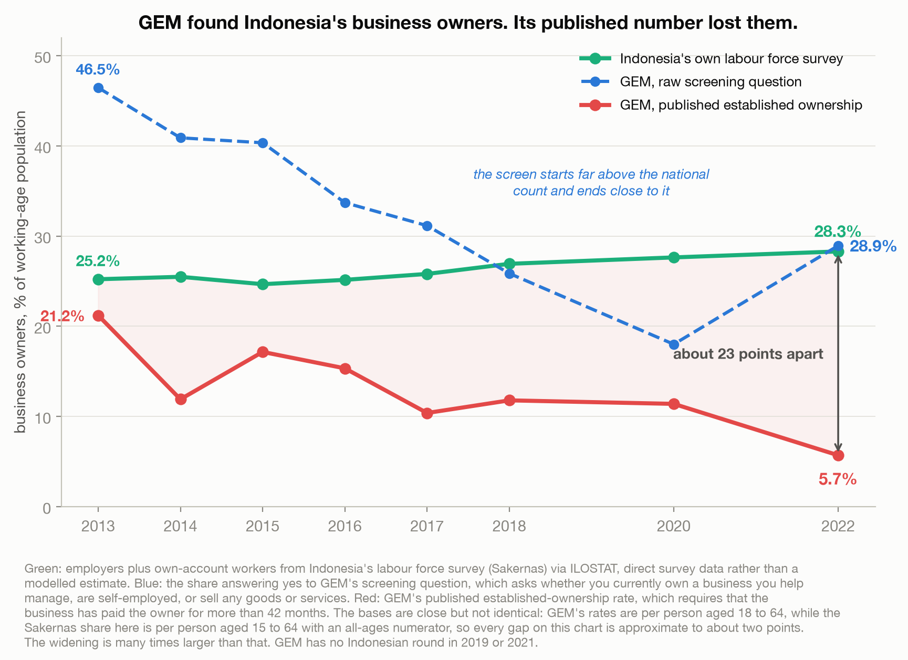
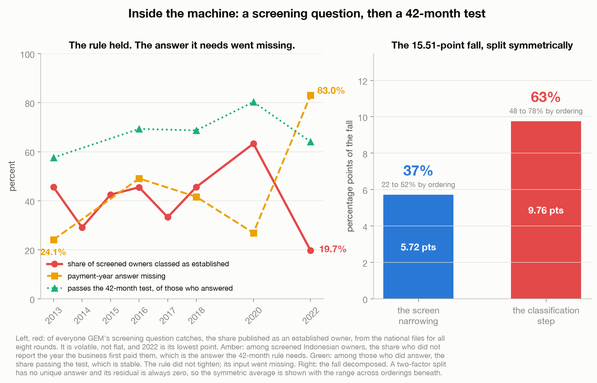
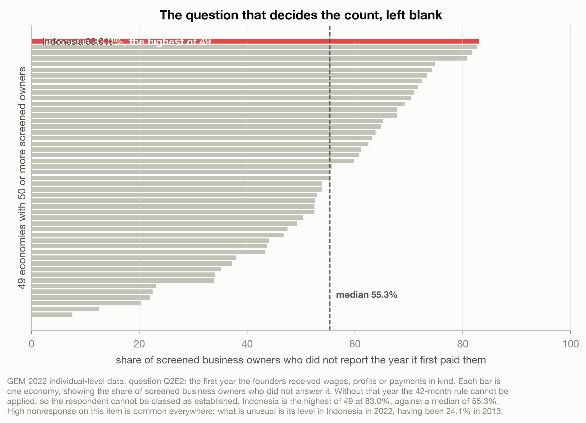
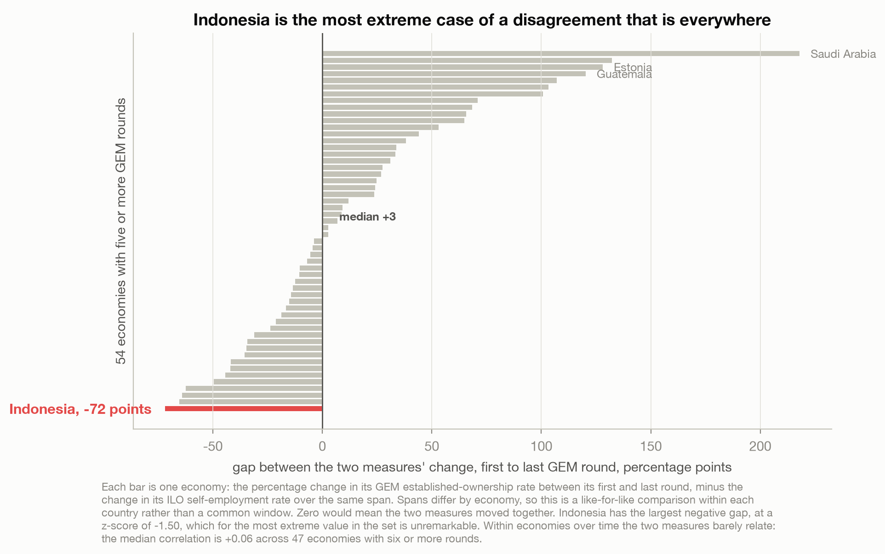

# The Survey Found Indonesia's Business Owners. It Just Couldn't Count Them.

> Indonesia's own labour force survey records 10.6 million MORE business owners in 2022 than in
> 2013. The Global Entrepreneurship Monitor records Indonesia losing roughly three quarters of them.
> GEM's own screening question agrees with Indonesia. What broke is the step in between.

A data story about how a derived indicator fails quietly. Built on GEM's openly published microdata,
benchmarked against Indonesia's Sakernas labour force survey via ILOSTAT. See
[`data/README.md`](data/README.md).

Live essay: [The Survey Found Indonesia's Business Owners. It Just Couldn't Count Them.](https://joechrisnaldy.com/blog/the-survey-couldnt-count-indonesias-business-owners).

---

## The argument in four charts

**GEM found them; its published number lost them.** On a shared denominator, business owners as a
share of the 18 to 64 population. Sakernas rises 25.2% to 28.3%, from 43.0 to 53.6 million people.
GEM's published established-ownership rate falls 21.2% to 5.7%. But GEM's own screening question
falls 46.5% to 28.9%, landing close to the national survey rather than far above it as in 2013. The
survey found the owners. The derived indicator did not keep them. (Bases differ slightly, GEM is
18-64 and the Sakernas share here is 15-64, so gaps are approximate to about two points.)



**The rule held; the answer it needs went missing.** Of everyone the screen catches, the share
published as established runs 45.6, 29.1, 42.5, 45.5, 33.3, 45.6, 63.3 and 19.7 across the eight
rounds: noisy, with 2022 the lowest. Among owners who gave a payment year, the share passing the
42-month test was 57.6% in 2013 and 64.1% in 2022, so the rule did not tighten. The 15.51-point fall
splits symmetrically into 5.72 points (37%) from the screen narrowing and 9.76 points (63%) from the
classification step. The split is order-dependent (screen 22% to 52%) and the residual is zero in
every ordering by construction, so it is no evidence of robustness.



**The question that decides the count, left blank.** Establishing that a business is older than 42
months requires question Q2E2, the first year it paid the owner. Among screened Indonesian owners
that answer was missing for 24.1% in 2013 and 83.0% in 2022, the highest of 49 economies against a
median of 55.3%.



**Indonesia is the worst case, not a special one.** Largest negative divergence of 54 economies, but
a z-score of only -1.50 in a spread running to +218. Within economies over time the two measures
barely relate: median correlation +0.06 across 47 economies.



---

## How the analysis works

| Step | Script | What it does |
|------|--------|--------------|
| 1. Analyze | [`build_analysis.py`](build_analysis.py) | Loads the GEM national panel and five rounds of Indonesian microdata, builds the Sakernas comparison on a shared denominator, opens the screen-then-classify machinery and decomposes the fall, measures the payment-year nonresponse against 49 economies, tests the three boring suspects, and runs the cross-country comparison. Writes `results.json`. |
| 2. Charts | [`make_charts.py`](make_charts.py) | The four figures above, every number interpolated from `results.json`. |

## Reproduce it

```bash
python3 -m venv .venv && source .venv/bin/activate
pip install -r ../requirements.txt pyreadstat zipfile-deflate64
# download the GEM, ILOSTAT and World Bank inputs (see data/README.md)
python build_analysis.py                     # writes results.json
python make_charts.py                         # writes charts/*.png
```

## Method and caveats

**Read the label, never the variable name.** Three separate errors in earlier drafts came from
guessing:

| Guessed | Actually | Consequence |
|---|---|---|
| `ESTBBUS1` as the published rate | "value **before** reclassification" | 3.49% for 2022 instead of 5.69% |
| `omyr5job` as the payment year | "Q2H2. Not counting owners, how many people will be working for this business five years from now?" | the entire mechanism computed on a headcount projection |
| raw `ownmge` as the screen | `OWNMGEyy` is what the published rate equals | 27.42% instead of 28.93% for 2022 |

The real payment-year gate is `omwageyr`, "Q2E2. What was the first year the founders of the business
received wages, profits, or payments in kind from this business?" Confirmed by crosstab: in 2022,
63.8% of owners who answered it are classed as established, against 8.8% of those who did not.

**The name trap.** GEM spells some economies two ways (USA and United States, Korea and South Korea,
Japan and japan, Uruguay and Urguay). Aliasing only the merge key while grouping on the raw string
double-counts them; that error put 55 economies in the set instead of 54.

**The Indonesia claim rests on directly collected data.** The World Bank's headline self-employment
series is a modelled ILO estimate, and a flat modelled line would prove nothing. The benchmark here
is Sakernas via ILOSTAT. ILOSTAT attaches an unresolved note to the Indonesian 2013 and 2021
observations, and 2013 is the baseline year, which is worth knowing.

**The cause is still not identified.** Interview mode is not recorded in either individual-level
file, so it could not be tested. The analysis localises the failure to the classification step and
quantifies it; it does not explain why the payment-year answer went missing so much more often.

**This is not a takedown.** Every check here exists because GEM publishes individual-level microdata
as a straight download, every round. Most programmes require an application. What the piece asks for
is a comparability note on the Indonesian series, not an apology.

Two wrong claims caught before publication and recorded in [`docs/`](docs/). The cross-country
agreement appears to decay from r = 0.65 to r = 0.28 and survives a naive significance test, but it
is an artefact of the roster shrinking from 68 economies to 47. And an earlier draft claimed the
conversion rate "held to within a tenth of a point across six years", which was an artefact of having
microdata for only 2013, 2016 and 2018; on all eight published rounds it swings between 29% and 63%.
