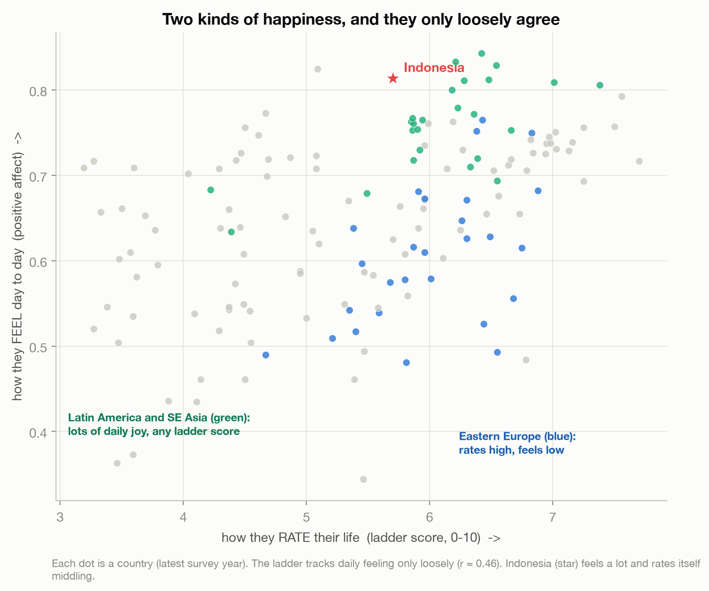
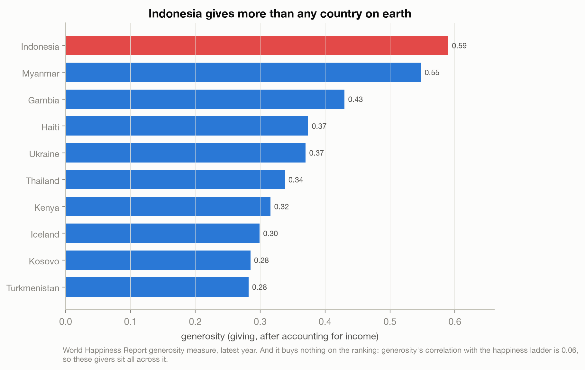
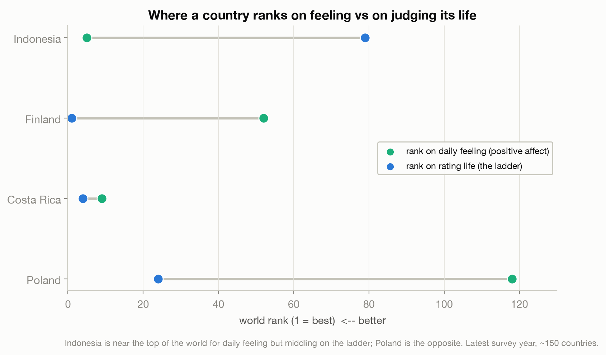

# The Most Generous Country on Earth Isn't the Happiest

> No country gives more than Indonesia, and few feel more daily joy, yet it ranks about 80th of
> 143 on the world happiness ladder. That gap is the essay: how you RATE your life and how you
> FEEL living it are two different questions, and they only loosely agree.

A data story on the two kinds of happiness, using Indonesia's generosity paradox. The World
Happiness ladder measures life-evaluation; daily positive affect measures feeling; and giving,
where Indonesia leads the world, does not move the ranking at all.

Live essay: [The Most Generous Country on Earth Isn't the Happiest](https://joechrisnaldy.com/blog/the-most-generous-country-isnt-the-happiest).

Data: [World Happiness Report - 2024](https://www.kaggle.com/datasets/jainaru/world-happiness-report-2024-yearly-updated)
(a re-upload; the authority is the World Happiness Report 2024, University of Oxford). Analysis
uses the 2024 cross-section for the ranking and the 2005-2024 panel (latest year, ~150
countries) for affect and correlations. Sources in
[`docs/`](docs/2026-07-14-happiness-generosity-references-verified.md).

---

## The story in three charts

**Two kinds of happiness.** Plot how countries rate their lives (the ladder) against how they
feel day to day (positive affect) and the two only loosely agree (correlation 0.46). Latin
America and Southeast Asia feel a lot of daily joy; Eastern Europe rates high but feels low.
Indonesia feels a lot and rates itself middling.



**Indonesia gives the most.** On the report's generosity measure (giving after accounting for
income), Indonesia is first of ~150 countries, corroborated by the Charities Aid Foundation's
World Giving Index. And giving buys nothing on the ranking: generosity's correlation with the
happiness ladder is 0.06, so the most generous countries sit all across it.



**Feeling vs judging.** Indonesia ranks near the top of the world for daily positive emotion but
middling on the ladder; Poland is the opposite. What the ladder rewards (income, social support)
is not what Indonesia has most of (daily joy, giving).



Neither picture is the whole truth. The ranking is not wrong; it measures how people judge their
lives, which is a different thing from how they feel living them. This is analysis, not life
advice.

---

## How the analysis works

| Step | Script | What it does |
|------|--------|--------------|
| 1. Profile | [`profile_data.py`](profile_data.py) | Structure of both files, Indonesia's profile, the affect and income probes. |
| 2. Analyze | [`build_analysis.py`](build_analysis.py) | Indonesia's world ranks, the generosity-to-ladder and affect-to-ladder correlations, and the chart data. Writes `results.json`. |
| 3. Charts | [`make_charts.py`](make_charts.py) | The three figures above. |

The correlations and affect analysis use the panel's latest year per country (~150 countries);
the official 2024 ladder rank uses the cross-section (143 countries). "Generosity" is the
report's income-adjusted giving residual. All results are descriptive and associational.

## Reproduce it

```bash
python3 -m venv .venv && source .venv/bin/activate
pip install -r ../requirements.txt          # pandas, numpy, scikit-learn, matplotlib
# download the data into data/ (see data/README.md)
python build_analysis.py                    # writes results.json
python make_charts.py                        # writes charts/*.png
```

## Method and caveats

Full design and plan notes are in [`docs/`](docs/). The two data files differ (cross-section =
factor contributions + official rank; panel = raw values + affect); the essay states which
number comes from where. Every relationship reported is a correlation, not a cause; culture
(communal and religious giving) is context, not a proven cause of the ladder gap. External facts
(the World Giving Index ranking, the evaluated-vs-experienced distinction) are cited in the
essay.
