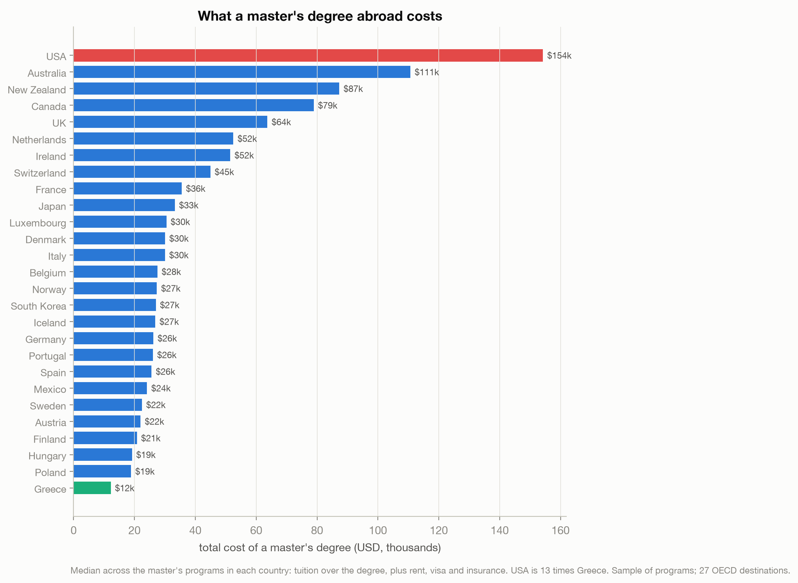
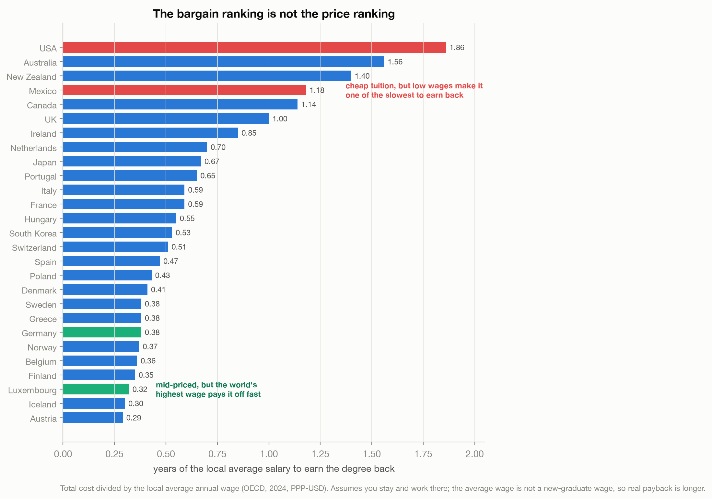
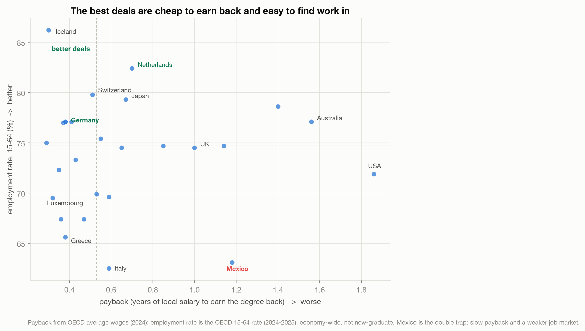

# The Cheapest Degree Abroad Isn't the Best Deal

> A master's in the USA costs thirteen times one in Greece. But sticker price is the wrong
> ruler. Once you divide the cost by what you would actually earn, the bargain ranking
> scrambles, and the cheapest countries stop being the best deals. Mexico looks cheap and is
> one of the worst.

A data story on the return on investment of studying abroad: cost versus salary versus
employment, across 27 OECD destinations.
Live essay: [The Cheapest Degree Abroad Isn't the Best Deal](https://joechrisnaldy.com/blog/the-cheapest-degree-abroad-isnt-the-best-deal).

Data: [Cost of International Education](https://www.kaggle.com/datasets/adilshamim8/cost-of-international-education)
(adilshamim8, 2025) for costs; OECD average wages (2024) and employment rate (15-64) for the
salary and job sides. The cost dataset has no salary or employment; those are in
[`external/`](external/) with their provenance.

---

## The story in three charts

**What it costs.** Total master's cost (tuition over the degree, plus rent, visa, insurance),
median per country. The USA is about $154,000; Greece about $12,000, one thirteenth as much.
The familiar expensive-West ranking.



**What it pays back.** Divide each country's cost by its average annual wage and you get
payback: years of local salary to earn the degree back. The ranking reshuffles. Mexico,
cheap to study in, becomes one of the worst deals (low wages); Germany, Austria and the
Nordics pay back in about four months; Luxembourg, mid-priced, pays back fastest of the big
names on the world's highest wage. Cheap is not the same as good value.



**Whether you can get a job.** Payback assumes you find work. Plot it against the employment
rate and the best deals cluster in one corner (fast payback, strong job market: Germany, the
Netherlands, Norway, Iceland). Mexico sits alone in the opposite corner, the double trap.



The one caveat that matters most: every wage is the destination country's, so the payback
only holds if you stay and work there. Many international students cannot, and a degree
brought home earns a home wage. This is a rough comparison of value, not a promise and not
financial advice.

---

## How the analysis works

| Step | Script | What it does |
|------|--------|--------------|
| 1. Profile | [`profile_data.py`](profile_data.py) | Shape, levels, per-country master's counts. |
| 2. Analyze | [`build_analysis.py`](build_analysis.py) | Total master's cost per country (median), payback = cost / OECD wage, employment overlay, cost-vs-payback ranks. Writes `results.json`. |
| 3. Charts | [`make_charts.py`](make_charts.py) | The three figures above. |

Cost = tuition over the degree + rent (monthly x 12 x duration) + visa + insurance; a lower
bound on living cost, applied identically to every country. Countries need at least three
master's programs, leaving 27 OECD destinations with wage and employment coverage.

## Reproduce it

```bash
python3 -m venv .venv && source .venv/bin/activate
pip install -r ../requirements.txt          # pandas, numpy, matplotlib
# download the cost data into data/ (see data/README.md); external/ is committed
python build_analysis.py                    # writes results.json
python make_charts.py                        # writes charts/*.png
```

## Method and caveats

Full design and plan notes are in [`docs/`](docs/). The caveats do not all point one way:
the rent-only cost and the PPP-adjusted wages make payback look too good, the destination
wage assumes you stay and work there, and the economy-wide average wage cuts both ways (new
graduates earn below it, established degree holders above it). Average wages: OECD, 2024,
PPP-USD. Employment: OECD 15-64 rate, 2024-2025.
