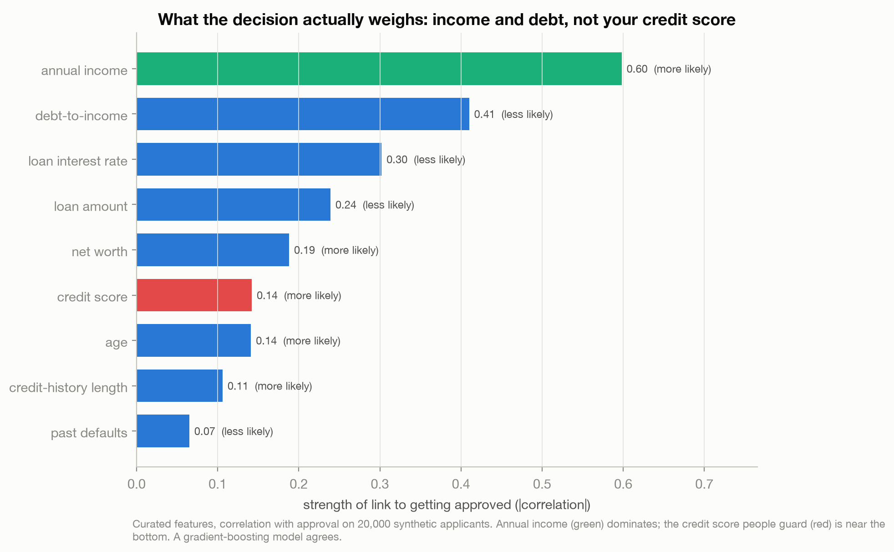
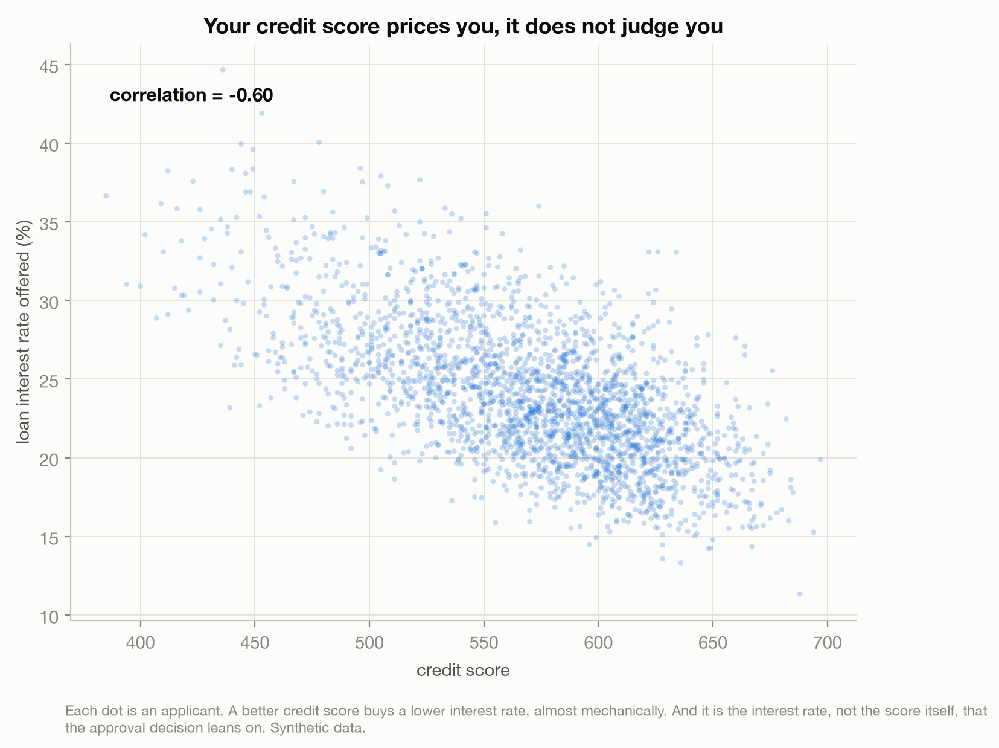
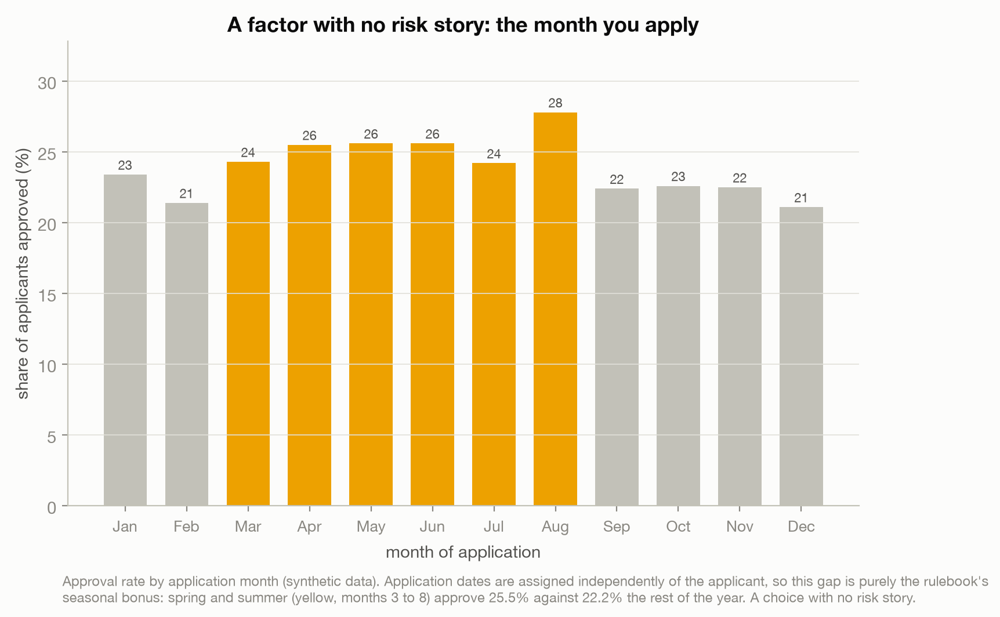
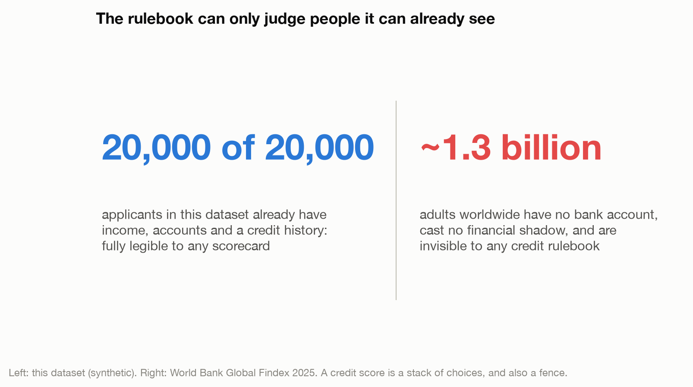

# What the Bank Sees When It Looks at You

> You fill in thirty boxes about your life and a lender compresses you into one yes-or-no number.
> This synthetic dataset ships the generator that built its own labels, so for once we can READ
> the rulebook: what the decision actually weighs, what it ignores, and who it can never see.

A data story about an automated loan decision as a stack of human choices. Income and debt decide
far more than the credit score people fret over; some factors (age, the season you apply) are not
about risk at all; and the whole apparatus can only judge people it can already see.

Live essay: [What the Bank Sees When It Looks at You](https://joechrisnaldy.com/blog/what-the-bank-sees).

Data: [Financial Risk for Loan Approval](https://www.kaggle.com/datasets/lorenzozoppelletto/financial-risk-for-loan-approval)
(Zoppelletto, 2024, CC0). SYNTHETIC: 20,000 fictional applicants, and, unusually, it ships the
generator script (`CSV_Generation.py`) that encodes its exact approval and risk rules. Every rule
below is a fact about that generator, not about any real bank. Sources in
[`docs/`](docs/2026-07-14-loan-rulebook-references-verified.md).

---

## The argument in four charts

**What the decision actually weighs.** Rank each factor by how strongly it moves approval. Annual
income leads by a wide margin (correlation +0.60); debt-to-income and the loan's interest rate come
next; the credit score people guard is near the bottom (+0.14). A gradient-boosting model agrees:
debt-to-income, interest rate and income on top, credit score sixth.



**Credit prices you, it does not judge you.** In the rulebook the interest rate is mostly a
function of the credit score (correlation -0.60, almost mechanical), and it is the rate, not the
score itself, that the approval decision leans on. So your credit acts indirectly, through the
price it sets, more than as a verdict.



**A choice with no risk story.** The cleanest factor with no risk rationale is the calendar. Because
application dates are assigned independently of the applicant, the seasonal gap is pure rule, not
confounding: spring and summer (months 3 to 8) approve 25.5% against 22.2% the rest of the year.
Approval also climbs with age and education, but those are more tangled: the age climb is confounding
(experience and income rise with age, and the one direct age term favors the middle-aged, working
against the rise), while the education climb is a mix of a direct degree bonus and income (about half
each). In real lending, U.S. law (the Equal Credit Opportunity Act) restricts using age; this
synthetic rulebook still carries a direct age term.



**Who the rulebook can not see.** Every one of the 20,000 applicants already has income, accounts
and a credit history: fully legible to any scorecard. About 1.3 billion adults worldwide have no
account at all (World Bank Global Findex 2025) and are invisible to any credit rulebook. A score is
a stack of choices, and also a fence.



The point is not that this toy bank is unfair. It is that a "risk score" is assembled from choices,
and here we can read them. This is analysis, not financial advice.

---

## How the analysis works

| Step | Script | What it does |
|------|--------|--------------|
| 1. Profile | [`profile_data.py`](profile_data.py) | Structure of the file, the key checks: does income outrank credit, is there a baked-in age preference, do the two targets agree. |
| 2. Analyze | [`build_analysis.py`](build_analysis.py) | Correlations with approval, permutation importance, credit-to-rate correlation, approval by age/education/season, and the legibility count. Writes `results.json`. |
| 3. Charts | [`make_charts.py`](make_charts.py) | The four figures above. |

Correlations are on all 20,000 rows. Permutation importance uses a `HistGradientBoostingClassifier`
(in-sample; the point is which features the model leans on, not out-of-sample accuracy). The credit
score to interest-rate link and the age, education and season effects are read from the generator
`CSV_Generation.py` and confirmed in the data.

## Reproduce it

```bash
python3 -m venv .venv && source .venv/bin/activate
pip install -r ../requirements.txt          # pandas, numpy, scikit-learn, matplotlib
# download the data into data/ (see data/README.md)
python build_analysis.py                    # writes results.json
python make_charts.py                        # writes charts/*.png
```

## Method and caveats

Full design and plan notes are in [`docs/`](docs/). The data is SYNTHETIC, so every relationship is
by construction: that is exactly why it is useful, because we are reading a designed rulebook, not
discovering a law of banking. Every reported number is a correlation or a generator rule, not a
cause. The real-world anchors (debt-to-income in underwriting, the ECOA age protection, the Findex
unbanked count) are external and cited in the essay; they are the contrast to the toy, not proof
about it. Nothing here is a claim that any real lender behaves this way. Not financial advice.
