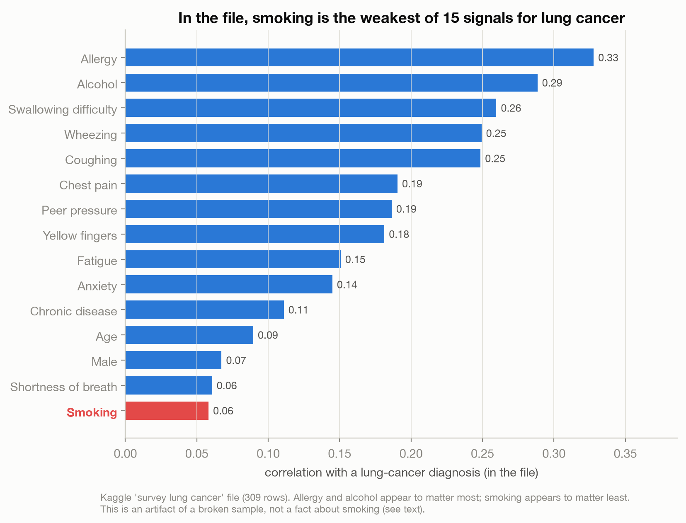
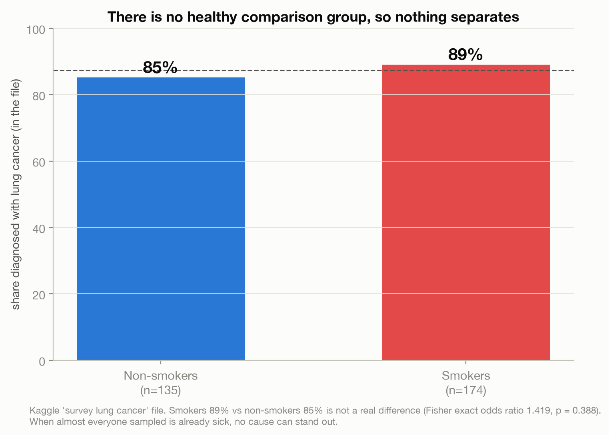
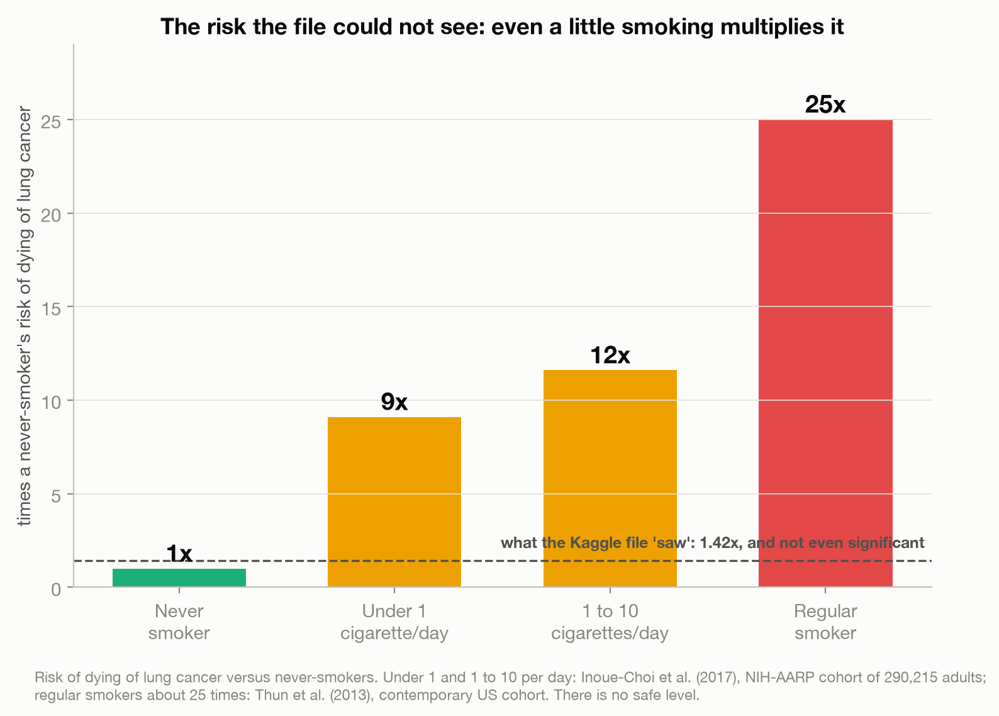
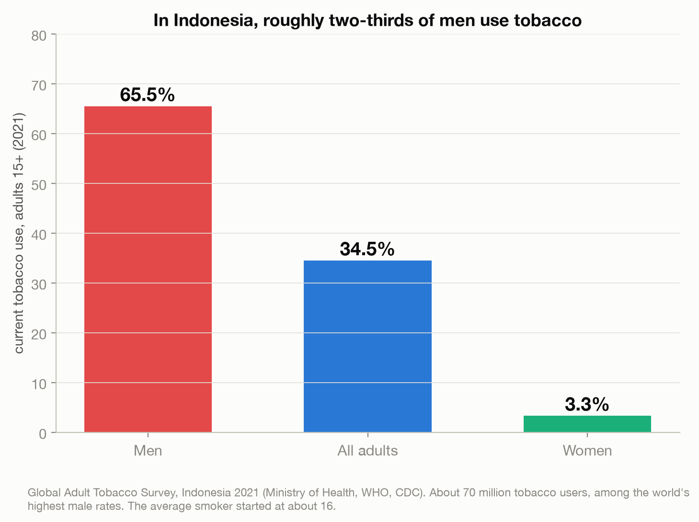

# The Internet's Favorite Lung-Cancer Dataset Says Smoking Is Harmless. It Isn't.

> Run the obvious analysis on the most-downloaded lung-cancer dataset on Kaggle and smoking looks
> irrelevant, it ranks last of 15 predictors. That is a selection-bias trap, not a fact. Smoking
> causes the large majority of lung cancer, and there is no safe amount.

A data story on how a clean, popular dataset can teach the opposite of one of the most settled facts
in medicine. The dataset is a FOIL: its correlations illustrate the trap, they are never used as
evidence about real causation. Every real-world figure is verified against primary sources.

Live essay: [The Internet's Favorite Lung-Cancer Dataset Says Smoking Is Harmless. It Isn't.](https://joechrisnaldy.com/blog/the-lung-cancer-dataset-that-cant-see-smoking).

Data: [Lung Cancer](https://www.kaggle.com/datasets/mysarahmadbhat/lung-cancer) (survey, 309 rows).
See [`data/README.md`](data/README.md) for why it cannot answer its own title question, and
[`docs/`](docs/2026-07-21-lung-cancer-selection-bias-design.md) for the verified sources.

---

## The argument in four charts

**The seduction.** In the file, smoking ranks last of 15 features by correlation with a cancer
diagnosis (0.06), behind allergy (0.33) and alcohol (0.29). A model built on it learns to shrug at
cigarettes.



**Why the file lies.** 87 percent of the sample already has cancer, there is no healthy comparison
group. Smokers (89 percent) and non-smokers (85 percent) have almost the same cancer rate; the
difference is not significant (odds ratio 1.42, p = 0.39). When everyone is sick, nothing predicts
sickness. That is selection bias.



**The truth the file cannot hold.** Real cohorts: people who smoke under one cigarette a day still run
about 9 times the risk of dying of lung cancer, 1 to 10 a day about 12 times, a regular smoker about
25 times. There is no safe level.



**Why it matters.** In Indonesia, roughly two-thirds of adult men use tobacco, among the world's
highest rates; about 70 million users (Global Adult Tobacco Survey, 2021). A dataset that whispers
"smoking barely matters" is the exact wrong lesson.



---

## How the analysis works

| Step | Script | What it does |
|------|--------|--------------|
| 1. Analyze | [`build_analysis.py`](build_analysis.py) | Loads the survey, computes the foil facts (87% cancer, smoking odds ratio + p, the 15-feature correlation ranking) and stores the verified real-epidemiology constants. Writes `results.json`. |
| 2. Charts | [`make_charts.py`](make_charts.py) | The four figures above (charts 1-2 from the file, charts 3-4 from verified sources). |
| 0. Vet | [`profile_data.py`](profile_data.py) | The go/no-go profile that confirmed the file is real but structurally unable to answer its title question. |

## Reproduce it

```bash
python3 -m venv .venv && source .venv/bin/activate
pip install -r ../requirements.txt          # pandas, numpy, matplotlib, scipy
# download the data into data/ (see data/README.md)
python build_analysis.py                     # writes results.json
python make_charts.py                         # writes charts/*.png
```

## Method and caveats

Full design and verified sources are in [`docs/`](docs/). The Kaggle file is used ONLY to illustrate
selection bias; its correlations are not findings about causation. The real-world figures (smoking's
~80-90% share of lung cancer, the relative-risk gradient including light smoking, "no safe level," the
Doll & Hill / British Doctors history, and Indonesia's prevalence) are verified against NCI, CDC, WHO,
and peer-reviewed cohorts (Inoue-Choi et al. 2017; Thun et al. 2013; Doll et al. 2004). Nothing here
argues, or should be read to argue, that smoking is safe. It is not, at any level.
