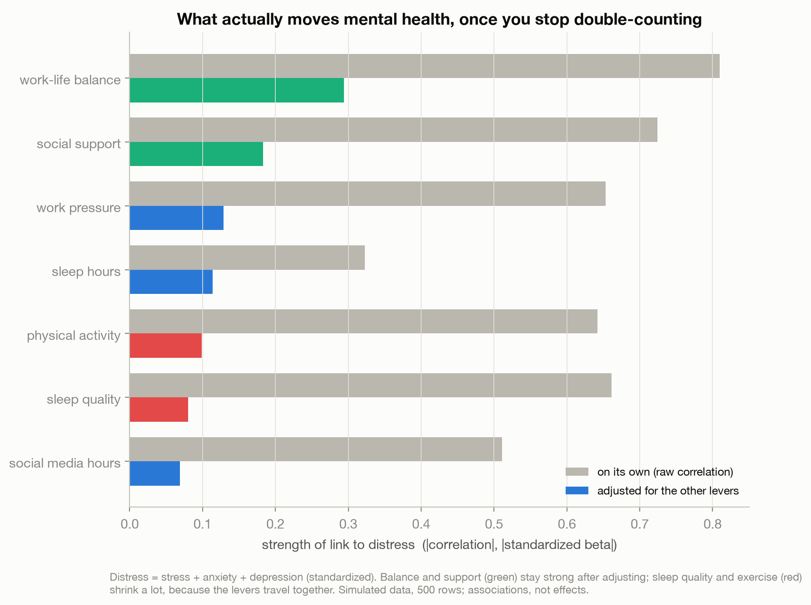
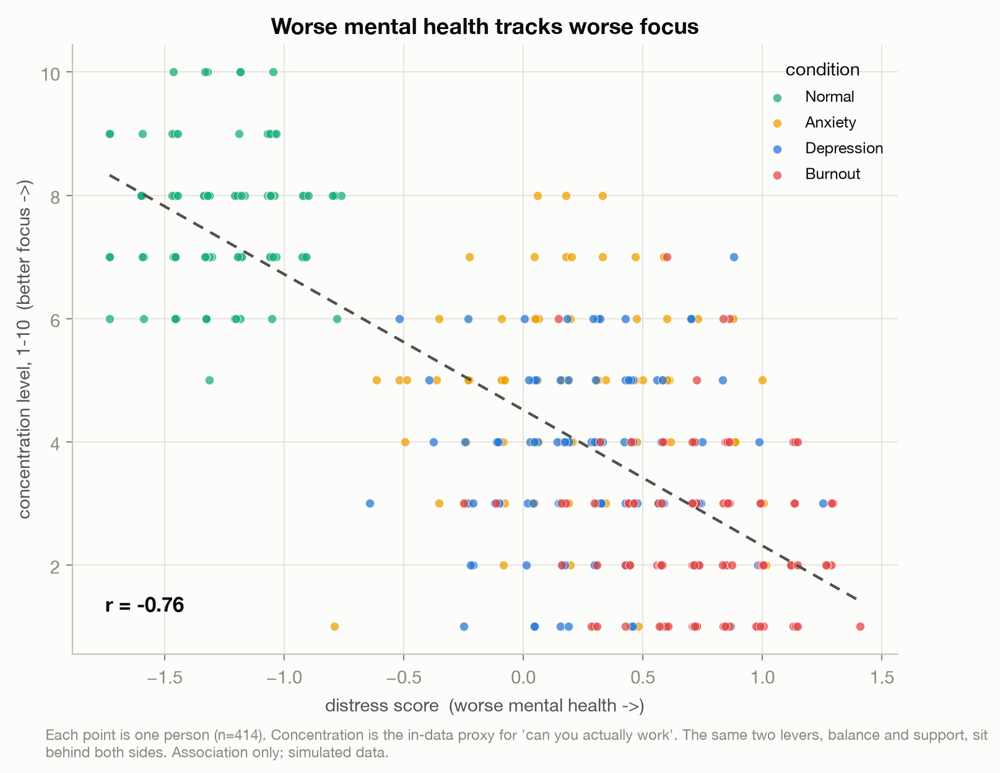
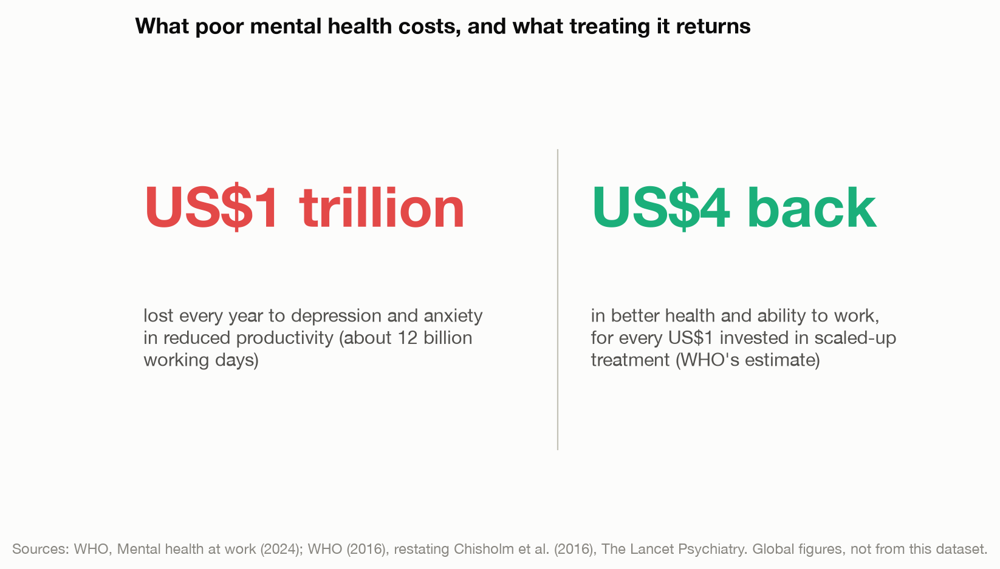

# What Actually Moves Your Mental Health (It Isn't the Sleep Tips)

> Everyone has a theory about what wrecks their head: too little sleep, too much work, no one
> to talk to. A dataset lets us rank those levers. Two of them, work-life balance and social
> support, do most of the work; a couple of the popular ones shrink once you stop
> double-counting. And the same levers that set your mental health set whether you can focus at
> all.

A data story on what moves mental health and why that matters for productivity: rank the
lifestyle levers, bridge them to focus, and price the payoff with real-world evidence, on a
simulated dataset whose limits are stated up front.

Live essay: [What Actually Moves Your Mental Health](https://joechrisnaldy.com/blog/what-actually-moves-your-mental-health).

Data: [Mental Health Prediction Dataset](https://www.kaggle.com/datasets/harpartapsingh13/mental-health-prediction-dataset)
(Harpartap Singh, 2026), 500 simulated records. The productivity and economic figures are
external (WHO); the dataset has no productivity column. Sources in
[`docs/`](docs/2026-07-12-mental-health-productivity-references-verified.md).

---

## The story in three charts

**What actually moves it.** Take a distress score (stress, anxiety and depression combined)
and measure each lifestyle factor against it, first on its own, then adjusted for the fact the
factors travel together. Work-life balance and social support stay on top. Sleep quality and
exercise look powerful on their own but shrink once you adjust, because people with good
balance also tend to sleep and move more. That is double-counting, made visible.



**Whether you can work.** The same levers that set mental health set focus. Plot the distress
score against `concentration_level`, the closest thing in the data to "can you actually get
work done," and the two move together (correlation about -0.76): worse mental health, worse
focus. Mental health is upstream of output.



**What it is worth.** The dataset stops at the person. For the scale-up, real evidence: the WHO
estimates depression and anxiety cost the global economy about US$1 trillion a year in lost
productivity, and puts the return on scaled-up treatment at about US$4 for every US$1 spent.



The caveat that matters most: this dataset is simulated and cross-sectional, so it cannot prove
the chain or say which way the arrow runs (mental health and productivity are chicken-and-egg).
We trust the ranking because real studies find the same levers. This is analysis, not medical
or financial advice.

---

## How the analysis works

| Step | Script | What it does |
|------|--------|--------------|
| 1. Profile | [`profile_data.py`](profile_data.py) | Shape, distributions, correlations, and the circularity check (how reconstructable the labels are). |
| 2. Analyze | [`build_analysis.py`](build_analysis.py) | Distress composite, lever ranking (raw correlation vs standardized-regression and permutation importance), and the distress-to-concentration bridge. Writes `results.json`. |
| 3. Charts | [`make_charts.py`](make_charts.py) | The three figures above. |

Distress = the mean of z-scored stress, anxiety and depression (higher is worse). The adjusted
ranking is a standardized regression (every lever put on the same scale, so the coefficients
are comparable and each is net of the others), cross-checked with permutation importance from a
gradient-boosting model that handles the missing values natively. The productivity and economic
figures in chart 3 are external (WHO), not computed from this dataset.

## Reproduce it

```bash
python3 -m venv .venv && source .venv/bin/activate
pip install -r ../requirements.txt          # pandas, numpy, scikit-learn, matplotlib
# download the data into data/ (see data/README.md)
python build_analysis.py                    # writes results.json
python make_charts.py                        # writes charts/*.png
```

## Method and caveats

Full design and plan notes are in [`docs/`](docs/). The honest limits, stated in the essay too:
the data is simulated ("real-world inspired"), perfectly balanced by condition, and the label
is about 86 percent reconstructable from the inputs, so the clean relationships are partly built
in. It is cross-sectional, so it cannot separate cause from effect or resolve the
mental-health-and-productivity chicken-and-egg. `concentration_level` is a proxy for
productivity, not productivity itself. All within-data relationships are associational. The
ranking is believable because peer-reviewed work finds the same levers (work strain, social
support, physical activity); those citations are in the essay.
