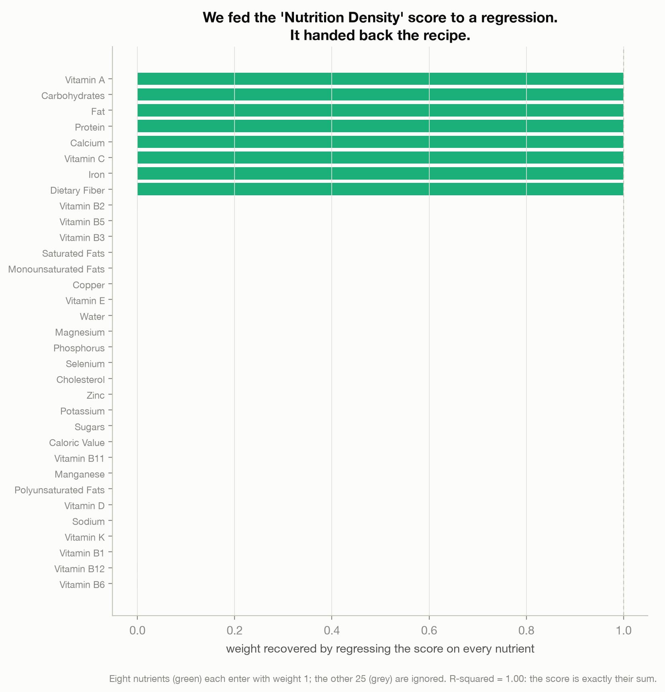
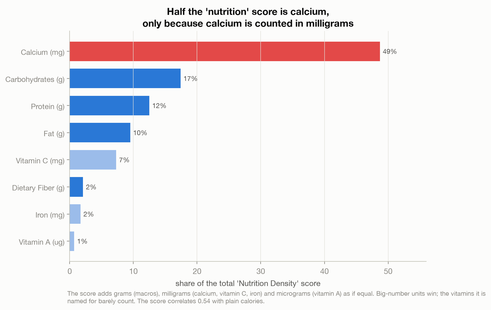
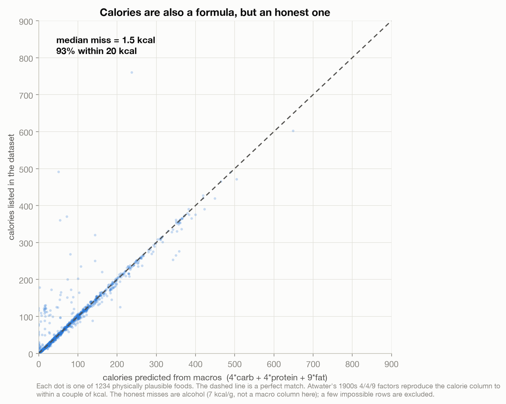

# The Score You Didn't Build (and Shouldn't Trust)

> A popular food dataset ships a "Nutrition Density" score. Feed it to a regression and it hands
> back its own recipe: an exact sum of eight nutrients, each weighted 1, measured in different
> units. Nearly half the "nutrition" score turns out to be calcium, only because calcium is
> counted in milligrams. Calories, by contrast, are a formula done right.

A data story about telling a measured number from a formula. Reverse-engineer a black-box
"health score", watch it fall apart, then compare it to two formulas that hold up: the calorie
count (honest arithmetic) and Nutri-Score (a disclosed, validated one).

Live essay: [The Score You Didn't Build](https://joechrisnaldy.com/blog/the-score-you-didnt-build).

Data: [Food Nutrition Dataset](https://www.kaggle.com/datasets/utsavdey1410/food-nutrition-dataset)
(Utsav Dey, 2024), 2,395 foods, per-100g nutrient columns. It is an unofficial convenience
dataset with real data-quality problems; the analysis leans only on the parts robust to bad
rows (the derived-column formulas), not on food rankings. Sources in
[`docs/`](docs/2026-07-14-nutrition-scores-references-verified.md).

---

## The story in three charts

**The recipe.** Regress the `Nutrition Density` column on every nutrient and it comes back with
an R-squared of exactly 1.00: the score is the sum of eight nutrients (Fat, Carbohydrates,
Protein, Dietary Fiber, Vitamin A, Vitamin C, Calcium, Iron), each with weight 1, and the other
25 ignored.



**What it is really made of.** Those eight are in different units, grams, milligrams,
micrograms, all added as if equal. So the sum is dominated by whichever nutrient carries the
biggest numbers. Calcium (milligrams) is 49 percent of the score; the macros (grams) are most
of the rest; the vitamins it is named for barely count (Vitamin A, in micrograms, is 0.7
percent). The "nutrient density" score even correlates 0.54 with plain calories.



**A formula done right.** Calories look like the same kind of derived number, but they are
honest arithmetic: Atwater's factors, 4 kcal per gram of carbohydrate and protein, 9 for fat,
reproduce the calorie column to a median miss of 1.5 kcal.



The difference between a good bundled score (Nutri-Score, whose weights are published and
validated against health outcomes) and a bad one is not that one bundles many things; it is
whether the weighting is disclosed, purposeful, and tested. This is an analysis, not medical or
financial advice.

---

## How the analysis works

| Step | Script | What it does |
|------|--------|--------------|
| 1. Profile | [`profile_data.py`](profile_data.py) | Shape, ranges, data-quality checks, the two story probes. |
| 2. Analyze | [`build_analysis.py`](build_analysis.py) | Recovers the score's formula by regression, decomposes its contribution shares, fits calories to Atwater 4/4/9. Writes `results.json`. |
| 3. Charts | [`make_charts.py`](make_charts.py) | The three figures above. |

The "recover the formula" step is a linear regression of the score on the 33 nutrient columns;
R-squared of 1.00 means the score is exactly a weighted sum, and the recovered weights are the
recipe. The contribution shares are each ingredient's mean value as a fraction of the total. The
calorie fit compares each food's listed calories to 4*carb + 4*protein + 9*fat on the
physically plausible rows.

## Reproduce it

```bash
python3 -m venv .venv && source .venv/bin/activate
pip install -r ../requirements.txt          # pandas, numpy, scikit-learn, matplotlib
# download the data into data/ (see data/README.md)
python build_analysis.py                    # writes results.json
python make_charts.py                        # writes charts/*.png
```

## Method and caveats

Full design and plan notes are in [`docs/`](docs/). The dataset is unofficial and not reliably
per-100g (about half the rows break the per-100g mass constraint), so the essay uses only the
robust, formula-level findings and does not rank foods or quote absolute amounts. The recovered
formula and the contribution shares are exact arithmetic on the data; the calorie fit is
descriptive. External facts (the Atwater factors, the Nutri-Score algorithm and its validation)
are each cited in the essay.
