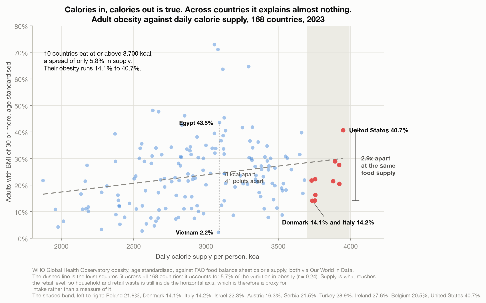
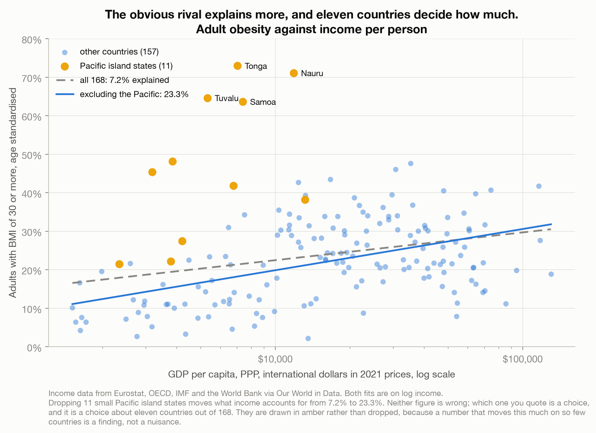
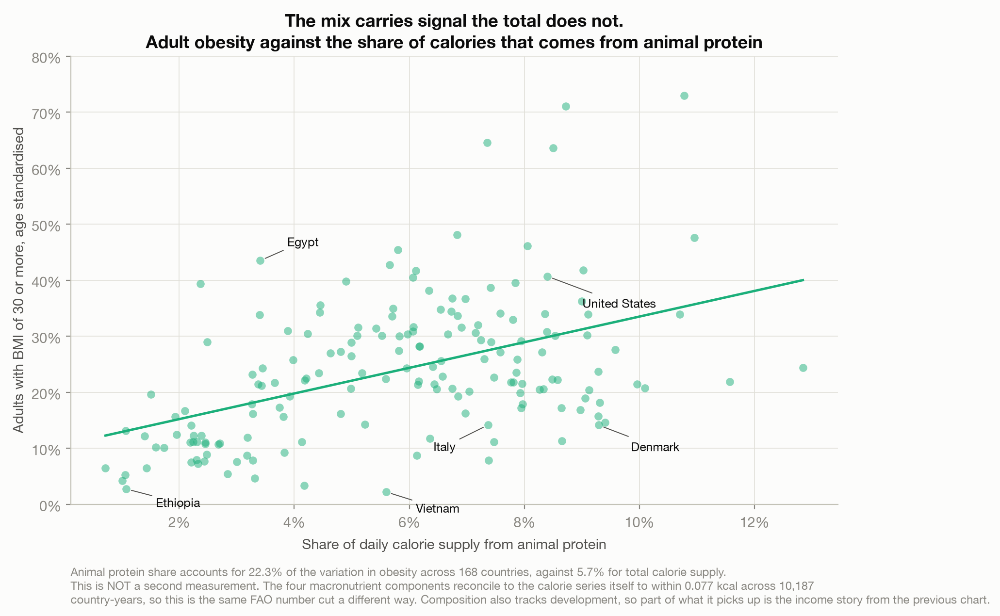
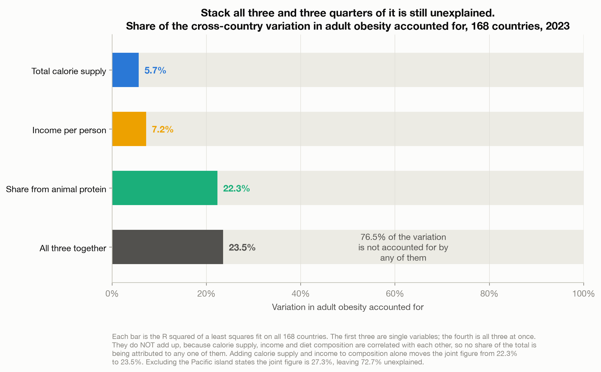

# Calories In, Calories Out Is True. It Explains Almost Nothing.

> Ten countries put more than 3,700 calories a day on the shelf per person. Their food supply
> varies by 5.8%. Their adult obesity rates run from 14.1% to 40.7%. Across 168 countries, calorie
> supply accounts for **5.7%** of the variation in obesity. Energy balance is an accounting
> identity: true in every country, which is exactly why it cannot explain why they differ.

A data story about the difference between an equation that balances and an explanation. Built
entirely on four Our World in Data extracts tracing to the WHO, the FAO, and Eurostat, the OECD,
the IMF and the World Bank jointly, with
nothing joined from anywhere else. See [`data/README.md`](data/README.md).

**This post is about explanation, not existence.** Around 5 million people died prematurely in 2019
as a result of obesity, and almost 10% of deaths that year came from its consequences. Nothing here
argues that obesity does not matter, and nothing here says anything about whether an individual's
intake affects their own weight. Every figure is a country-level association.

---

## The argument in four charts

**The quantity of food does not do the work.** Line up 168 countries for 2023 and daily calorie
supply accounts for **5.7%** of the variation in adult obesity, a correlation of 0.24. The ten
countries at or above 3,700 kcal span **14.1% to 40.7%** obesity across a 5.8% spread in supply.
The sharpest single pair: Vietnam at 3,086 kcal and **2.2%** obesity against Egypt at 3,094 kcal
and **43.5%**. Eight calories apart, 41 points apart. There are 69 such pairs within 30 kcal and
more than 25 points, 34 of them involving no Pacific island state.



**The obvious rival does better, and eleven countries decide by how much.** Income per person
accounts for **7.2%** across all 168 countries, barely more than calories. Drop the eleven Pacific
island states, which sit at middle incomes with the highest obesity on earth (Tonga 73.0%, Nauru
71.1%), and it becomes **23.3%**. Compare like with like: on those same 157 countries calories
explain 7.8%, so income beats calories threefold, not fourfold. Both numbers are correct. Which one gets quoted is a choice about
7% of the sample, so the chart draws those eleven in a distinct colour rather than deleting them.



**The mix beats the total, with a caveat that matters.** Share of calories from animal protein
accounts for **22.3%**, fat share 21.0%, carbohydrate share 22.5% with the sign reversed. Four
times what the calorie total manages. But this is **not a second measurement**: the four
macronutrient components sum to the calorie series itself to within 0.077 kcal across 10,187
country-years. It is the same FAO number cut differently, and it overlaps with the income story.



**Stack all three and three quarters is still missing.** Together they reach **23.5%**, leaving
**76.5%** unaccounted for. Adding calorie supply and income to composition alone moves the figure
by about one percentage point. Excluding the Pacific states the joint fit reaches 27.3%, still
leaving 72.7%. Back on all 168, the fit misses by 8.6 points on average and 7.4 at the median, with
a root mean squared error of 11.0, on an outcome running from 2.2% to 73.0%. France sits at 11.3% obesity where the model predicts 29.7%; South
Korea 7.9% against 26.1%.



---

## How the analysis works

| Step | Script | What it does |
|------|--------|--------------|
| 0. Vet | [`profile_data.py`](profile_data.py) | Answers the go/no-go questions before anything is built: are the entities countries or OWID aggregates, how far apart are the crude and age-standardised obesity series, what is the latest common year, how many countries survive the join, do the macronutrient components reconcile to the calorie total, and are the values physically possible. |
| 1. Analyze | [`build_analysis.py`](build_analysis.py) | Filters to real countries, builds the 2023 panel, computes every R2 reported here both with and without the Pacific states, fits the joint model and its residuals, finds the near-identical calorie pairs by rule rather than by hand, and writes `results.json`. |
| 2. Charts | [`make_charts.py`](make_charts.py) | The four figures above. Every figure derived from the data is interpolated from `results.json`; typed literals are limited to axis limits, layout coordinates and the stated 3,700 kcal threshold, which is itself emitted to `results.json` so the two cannot drift. |

## Reproduce it

```bash
python3 -m pip install pandas numpy matplotlib
# download the source files, see data/README.md
python3 profile_data.py                       # the vet, prints to stdout
python3 build_analysis.py                     # writes results.json
python3 make_charts.py                        # writes charts/*.png
```

## Method and caveats

**Seven traps, all in packaging or scope rather than error.** Full detail in
[`data/README.md`](data/README.md).

| Trap | What it does if ignored | Handling |
|---|---|---|
| OWID's default obesity chart is the **crude** estimate | age structure ends up on the axis; Greece reads 6.1 points heavier crude than age standardised, Palestine 4.3 points lighter | the age-standardised series everywhere |
| OWID aggregates share the entity column | `World` and continents become fabricated points in a country scatter | keep only genuine ISO3 codes; no real country is lost to the rule, and an earlier version of this file wrongly claimed Kosovo was |
| Macronutrients look like a second measurement | composition reads as corroboration of the calorie result | they sum to the calorie series within 0.077 kcal; reported as a decomposition |
| FAO measures supply, not intake | the calorie axis is treated as if it were intake | stated; the sign of the resulting bias is NOT known, and an earlier version of this file claimed it was |
| Eleven Pacific states move the income result | 7.2% or 23.3%, whichever suits | both reported, in the text and on the chart |
| Country averages are not people | the ecological fallacy | every claim scoped across countries, explicitly |
| Income is the binding constraint on the sample | the panel looks like it is set by obesity and food data | obesity and calories alone give 172; requiring income gives 168, dropping French Polynesia, Syria, Venezuela and Yemen |

**Analysis year 2023**, the latest year all four series overlap. Obesity runs to 2024 and income to
2025; FAO stops at 2023. **168 countries** survive the join.

**Single-variable and joint R2 do not add.** The predictors are correlated, so the joint fit is one
number and no share of it is attributed to any single variable.

**BMI of 30 or more is a threshold on a continuous measure**, and BMI does not measure body fat.

**Not a causal claim, and not a policy argument.** Nothing here identifies why any country sits
where it does. The post treats the unexplained three quarters as an open question rather than
filling it with untested candidates, which is the same discipline the argument itself demands.
