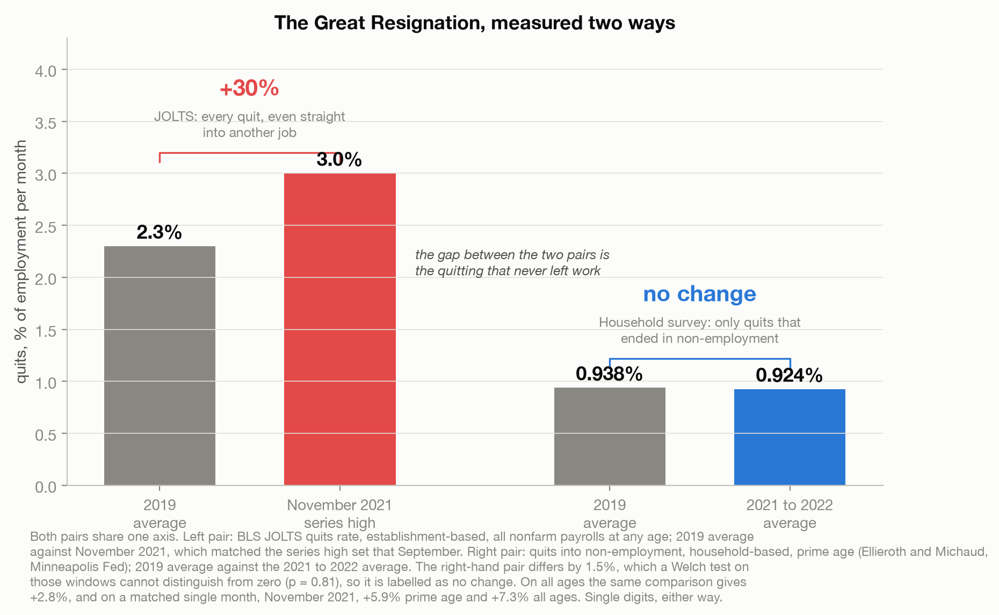
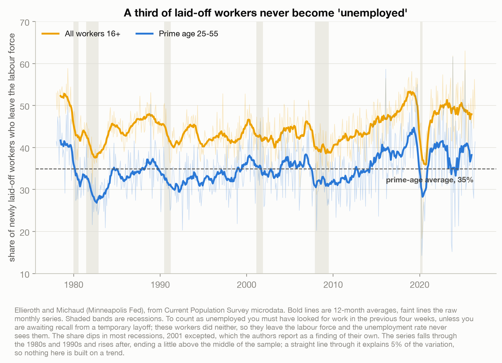
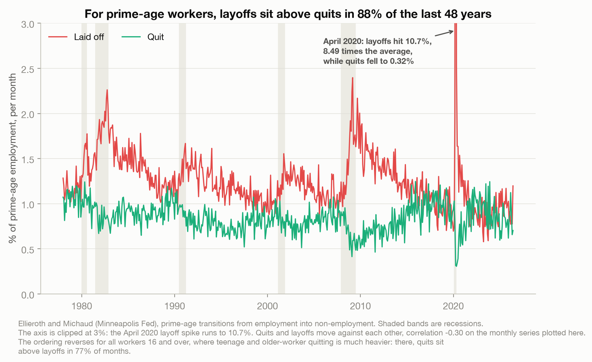
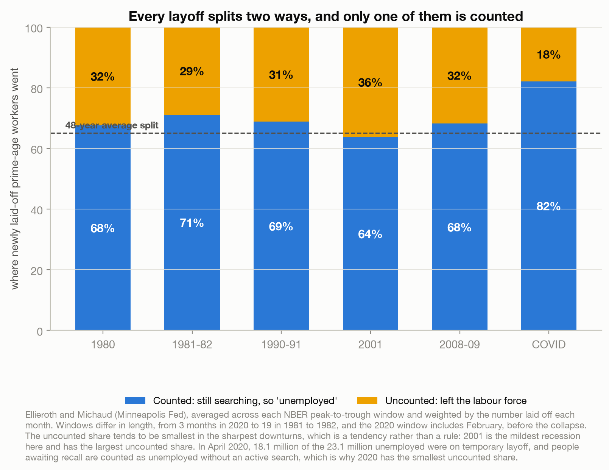

# Nobody Quit. Nobody Was Unemployed Either.

> Every month the world reads two numbers to decide how the labour market feels. One counts people
> leaving a job even when they walk straight into another one. The other counts only people still
> actively looking, so it loses anyone who gives up. Both are real. Neither measures what we think.

A data story about what the quits rate and the unemployment rate actually count. Built on 48 years of
Federal Reserve research data plus verified BLS primary sources. No Kaggle dataset; see
[`data/README.md`](data/README.md).

Live essay: [Nobody Quit. Nobody Was Unemployed Either.](https://joechrisnaldy.com/blog/nobody-quit-nobody-was-unemployed-either).

---

## The argument in four charts

**The Great Resignation, measured two ways.** The quits rate everyone quoted rose about 30%, from
2.3% in 2019 to 3.0% in November 2021, matching the series high it had set that September (the
record that month was the level, 4.5 million). Over the same period, quits that actually ended in
non-employment did not move: 0.938% against 0.924%, a gap a test on those windows cannot separate
from zero. On all ages the same comparison gives +2.8%, and on a matched single month +5.9% prime age
and +7.3% all ages. Single digits at most, against thirty. JOLTS counts the job-switcher; the
household survey does not.



**A third of laid-off workers never become "unemployed."** To be counted you must have looked for
work in the previous four weeks, unless you are awaiting recall from a temporary layoff. These
workers did neither, so they leave the labour force and the headline rate never sees them. Prime-age
average 35%, all workers 44.5%.



**For prime-age workers, layoffs sit above quits in 88% of the last 48 years**, the opposite of the
impression the quits rate gives, and the two move against each other (correlation -0.30 monthly on
this panel; the source paper reports -0.46 on six-month averages through 2024). April 2020 is the
extreme: prime-age layoffs of 10.7%, 8.49 times the average, while quitting collapsed to 0.32%. The
ordering flips for all workers 16 and over, where quits sit above layoffs in 77% of months.



**Every layoff splits two ways and only one is counted.** The uncounted share tends to be smallest in
the sharpest downturns, because workers on temporary layoff awaiting recall are counted as unemployed
without an active search. It is a tendency, not a rule: 2001 is the mildest recession here and has
the largest uncounted share of the six.



---

## How the analysis works

| Step | Script | What it does |
|------|--------|--------------|
| 0. Vet | [`profile_data.py`](profile_data.py) | Realism checks on the panel: every recession present, COVID at 8.49x the average. |
| 1. Analyze | [`build_analysis.py`](build_analysis.py) | Recomputes every panel figure from the `.dta` files and holds the verified external constants, each with its source. Writes `results.json`. |
| 2. Charts | [`make_charts.py`](make_charts.py) | The four figures above. |

## Reproduce it

```bash
python3 -m venv .venv && source .venv/bin/activate
pip install -r ../requirements.txt          # pandas, numpy, matplotlib, scipy
# download the two .dta files (see data/README.md)
python build_analysis.py                     # writes results.json
python make_charts.py                         # writes charts/*.png
```

## Method and caveats

Full design and sources are in [`docs/`](docs/). Five things worth stating plainly.

The unemployment rate is not wrong. It measures exactly what it defines, and the gap is between that
definition and how the number is read.

Chart 1 puts both measures on one shared axis. That is honest about the level gap, and the gap is
itself the point, but the two are not a like-for-like match: JOLTS is establishment-based and covers
nonfarm payrolls at any age, while the household series is reported here for prime age (25 to 55, the
authors' definition). The contrast is therefore also checked on all ages and on a matched single
month, and all four versions agree.

The share of laid-off workers who leave the labour force *falls* during most recessions, the opposite
of the intuitive story: people on temporary layoff awaiting recall are counted as unemployed without
searching. Share and level point different ways, though. Outside recessions a larger *fraction* of
the laid-off stop looking (35.3% against 31.5%); inside recessions a larger *number* vanish outright
(0.50% of employment per month against 0.43%), because there are far more layoffs.

The June 2026 unemployment rate fell because the numerator fell, not because the denominator emptied.
A shrinking labour force pushes the rate up, not down. `build_analysis.py` holds the counterfactuals.

Announced job cuts from private trackers are announcements, not measured separations, and are never
mixed with BLS measurements here.
