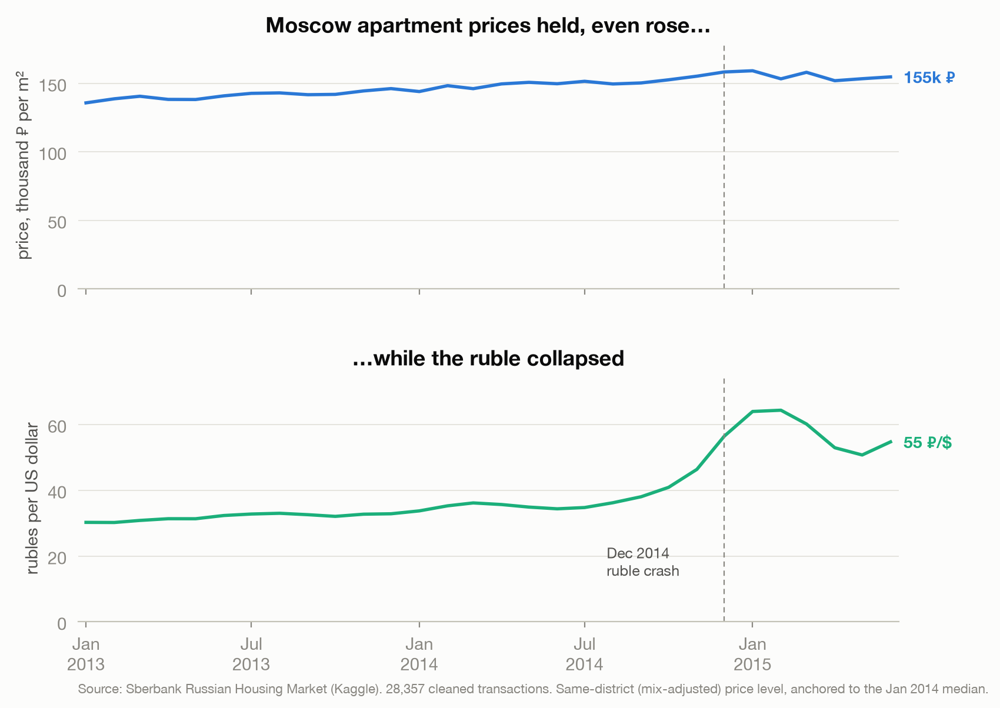
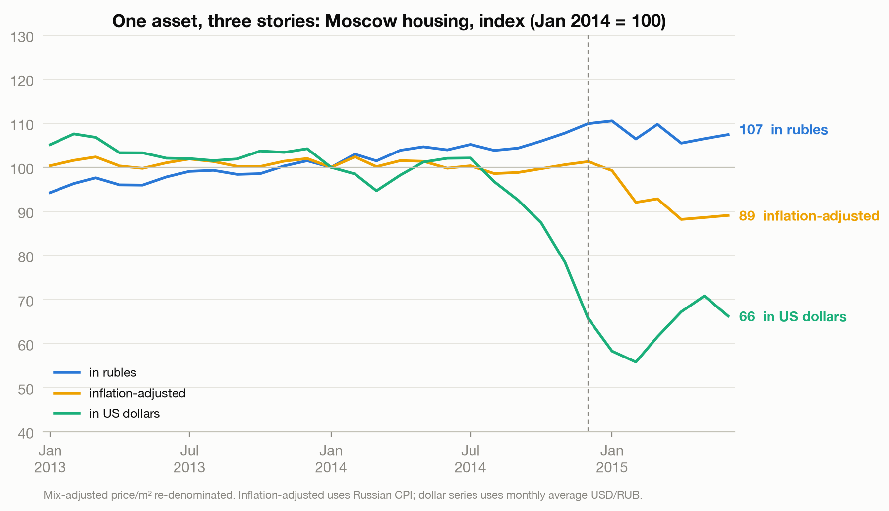
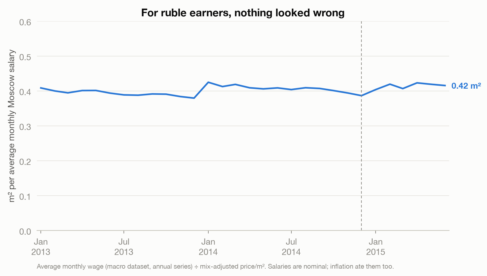
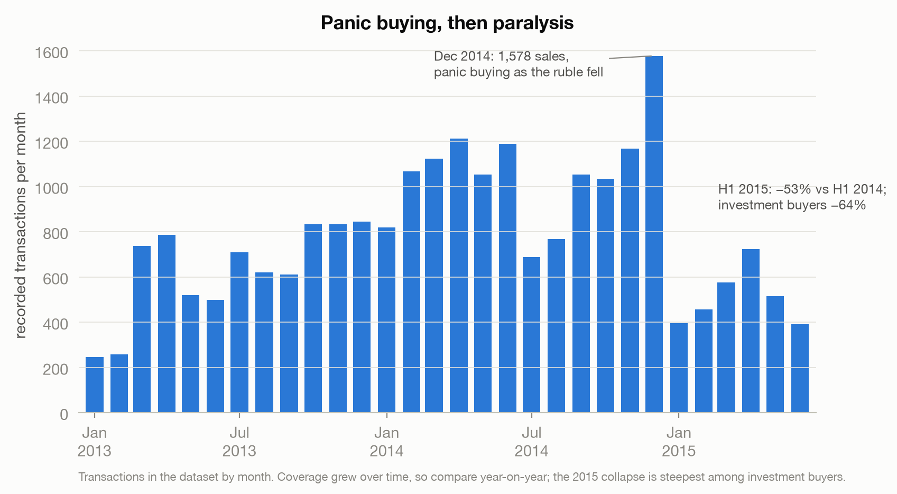
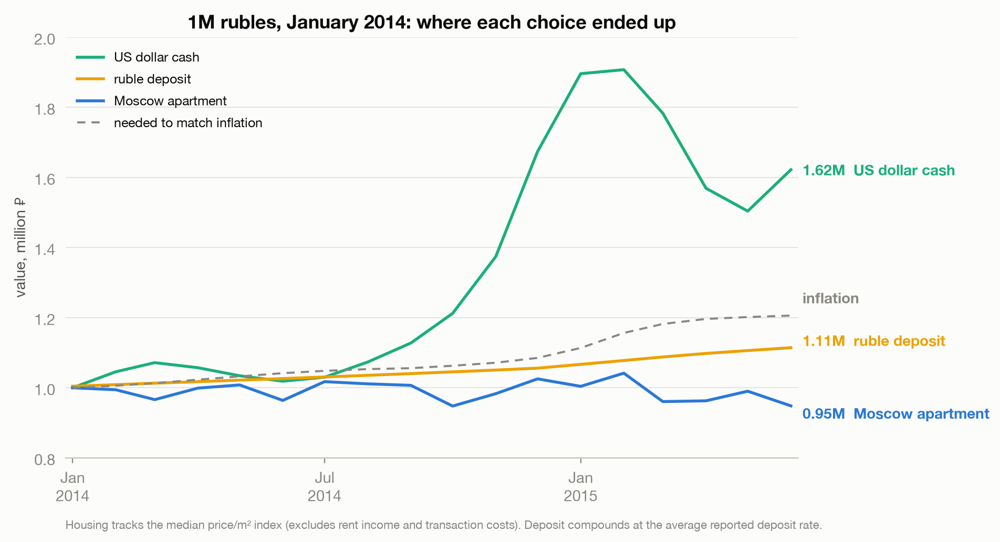

# Property Isn't the Hedge You Think

> When Russia's currency collapsed in 2014, Moscow apartment prices didn't fall; they rose. That is exactly how property owners lost a third of their wealth, in world prices, without noticing.

This is a data story about the most dangerous kind of stability. It uses 30,471 Moscow apartment sales published by Sberbank for a [Kaggle competition](https://www.kaggle.com/c/sberbank-russian-housing-market), spanning August 2011 to June 2015, with the 2014 ruble crisis sitting right in the middle.

**Read the full essay:** [joechrisnaldy.app/blog/property-isnt-the-hedge-you-think](https://joechrisnaldy.app/blog/property-isnt-the-hedge-you-think)
**See every step:** [`analysis.ipynb`](analysis.ipynb)

---

## The story in five charts

**In rubles, prices held. The ruble did not.** Held the neighborhood mix constant, apartment prices drifted up about 7% while the ruble went from 33 to the dollar to a monthly low near 64.



**Same asset, three measuring sticks.** Indexed to January 2014, the identical price series reads +7% in rubles, minus 11% adjusted for inflation, and minus a third in US dollars. Nothing about the apartments changed. Only the ruler did.



**From inside the ruble, nothing looked wrong.** One month of the average Moscow salary bought about the same floor space before and after the crisis, which is precisely what makes money illusion so durable.



**The prices were real; the market was not.** December 2014 was the busiest month in the dataset (panic buying), and then the first half of 2015 ran 53% below the year before. Stable prices on a market that has stopped transacting are prices nobody is testing.



**What the money could have done instead.** A million rubles placed in January 2014 ended June 2015 worth 1.07M as an apartment, 1.11M in a boring deposit, and 1.62M as US dollars in a drawer. Keeping pace with inflation alone required 1.21M.



The takeaway, argued in full in the essay: a hedge has to be denominated in the thing you will actually need. Property hedges local inflation in normal times; it does not carry you through a currency collapse.

---

## How the analysis works

The pipeline is four small, readable scripts. Each does one job.

| Step | Script | What it does |
|------|--------|--------------|
| 1. Profile | [`profile_data.py`](profile_data.py) | First look: shape, date range, missingness, price distribution, the suspicious round-number prices. |
| 2. Build the series | [`build_series.py`](build_series.py) | Cleans the data, builds the monthly price index, joins the macro data, and re-denominates into real, dollar, and salary terms. Also computes the investment counterfactual. |
| 3. Robustness | [`robustness.py`](robustness.py) | Tests whether the "flat prices" result is an artifact of which neighborhoods sold, using three independent indices. |
| 4. Charts | [`make_charts.py`](make_charts.py) | Renders the five figures above. |

Three decisions carry most of the weight, and all three are visible in the code:

1. **Dropping the fakes.** 1,504 "sales" are recorded at exactly 1 or 2 million rubles: declared prices for tax purposes, not real ones. They are removed, along with impossible apartment sizes, and price per square meter is trimmed to the 1st to 99th percentile. See `load_clean_train` in [`build_series.py`](build_series.py).

2. **Holding the mix constant.** Moscow absorbed the much cheaper "New Moscow" territories in 2012, and their share of monthly sales swings from roughly 14% to 38%. A plain citywide average silently blends two different cities. The headline series is a **district fixed-effects index** (within-district demeaned log price per square meter, averaged by month), so it compares like with like. [`robustness.py`](robustness.py) shows why this matters: the raw median looks noisier and ends about 12 points lower, but the New-Moscow-only and fixed-effects series agree.

3. **Changing the measuring stick.** The same ruble series is divided by the exchange rate, by CPI, and expressed in months of salary. This is the whole argument in one operation: see the `psqm_usd`, `psqm_real`, and `sqm_per_salary` columns in `build`.

---

## Reproduce it

```bash
# 1. Set up the environment
python3 -m venv .venv
source .venv/bin/activate
pip install -r ../requirements.txt

# 2. Get the data (see data/README.md), then place the CSVs in data/
#    data/train.csv, data/macro.csv

# 3. Run the pipeline
python profile_data.py     # optional: first look at the data
python build_series.py     # prints the key numbers
python robustness.py       # the mix-shift check
python make_charts.py      # writes charts/*.png
```

Or open [`analysis.ipynb`](analysis.ipynb) to run the whole thing with narration and inline output.

## Data

Not included in this repository (Kaggle's competition rules). Download instructions are in [`data/README.md`](data/README.md). You need `train.csv` and `macro.csv`.

## Method and caveats

The design and full method notes are in [`docs/2026-07-09-money-illusion-design.md`](docs/2026-07-09-money-illusion-design.md). In short: the median transaction index is not a repeat-sales index, so within-district mix can still shift; declared prices likely understate true prices even after cleaning; dataset volume partly reflects Sberbank's growing coverage, so volume is compared year on year; the housing counterfactual excludes rent income and transaction costs; and the data ends in June 2015, while the crisis did not. External facts in the essay are cited there in APA 7.
