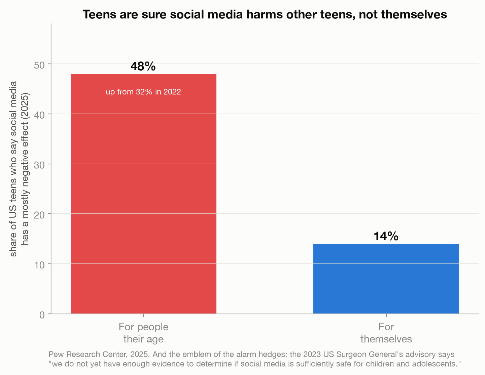
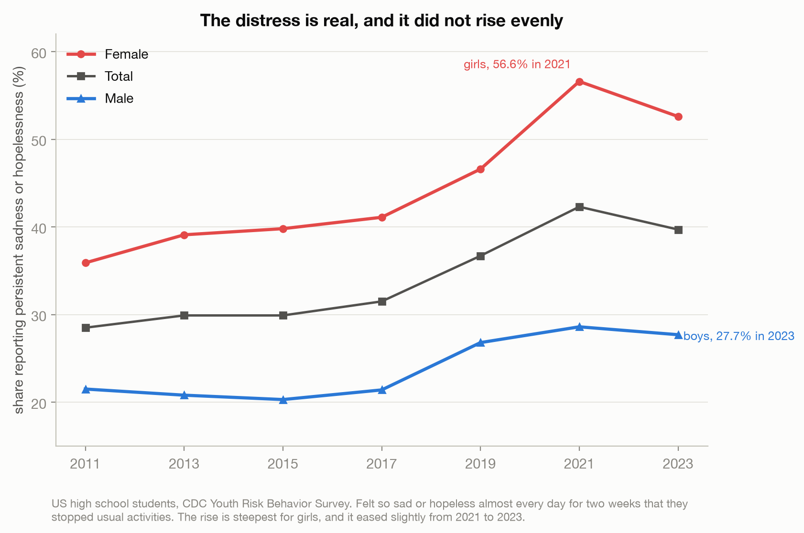
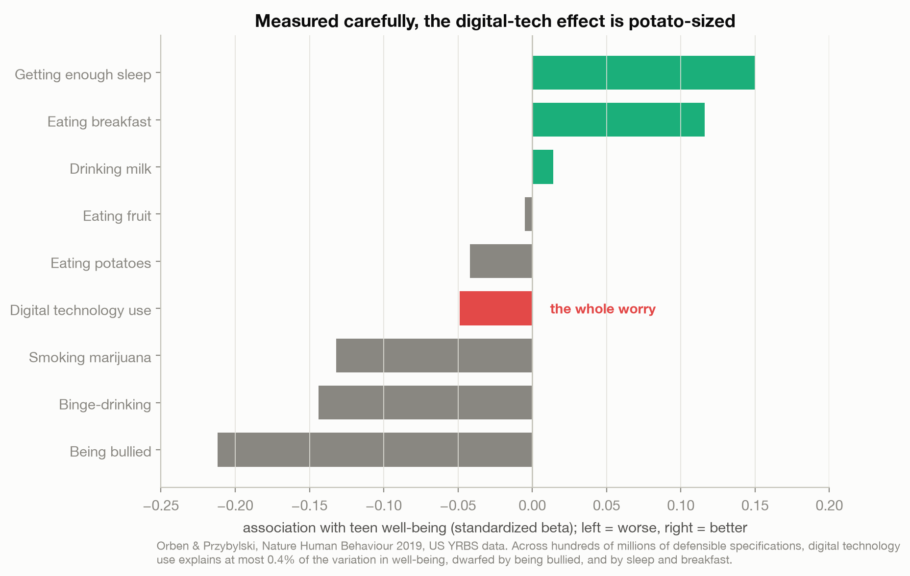
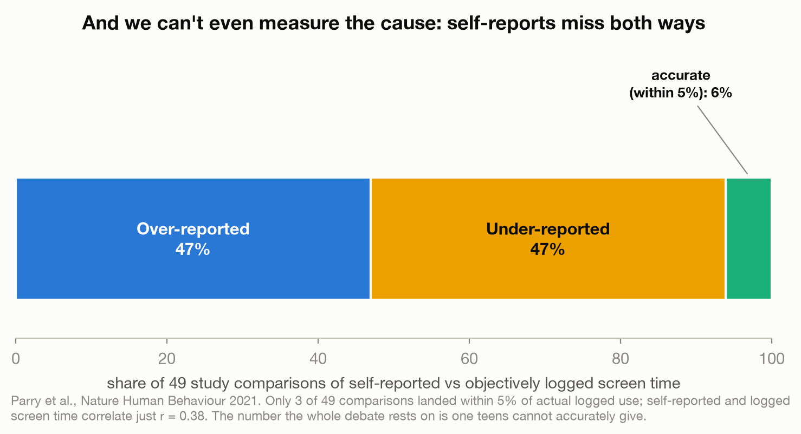

# Everyone Knows Social Media Is Wrecking Teens. The Evidence Doesn't.

> The claim that social media is destroying adolescent mental health is now common sense: a
> bestseller, a Surgeon General advisory, school phone bans, laws. But the careful evidence
> underneath that certainty is thin. This post is about the gap between how sure we are and how
> little we can actually show. Not that social media is harmless, that we ruled before we could
> measure.

A data story built entirely from real, primary sources (no Kaggle dataset; a synthetic one on this
topic was reviewed and rejected as unusable). Every number is verified against its original report
or paper.

Live essay: [Everyone Knows Social Media Is Wrecking Teens. The Evidence Doesn't.](https://joechrisnaldy.com/blog/everyone-knows-social-media-is-wrecking-teens).

Sources and exact quotes: [`docs/`](docs/) and [`data/README.md`](data/README.md).

---

## The argument in four charts

**Everyone is sure, mostly about other people's kids.** In 2025, 48% of US teens said social media
has a mostly negative effect on people their age (up from 32% in 2022), but only 14% said it
negatively affects them personally. And the emblem of the alarm, the 2023 US Surgeon General's
advisory, explicitly says "we do not yet have enough evidence to determine if social media is
sufficiently safe for children and adolescents."



**The distress is real, and it did not rise evenly.** The share of US high schoolers reporting
persistent sadness or hopelessness rose from 28.5% in 2011 to 42.3% in 2021 (CDC), far steeper for
girls (35.9% to 56.6%) than boys (21.5% to 28.6%). It eased slightly to 39.7% in 2023. Something
real happened; the question is the cause.



**Measured carefully, the effect is potato-sized.** Mapping out hundreds of millions of defensible
specifications and running a vast number of them, Orben & Przybylski found digital technology use
explains at most 0.4% of the variation in teen well-being. Its association sits next to eating potatoes, and is dwarfed by being bullied, and
by sleep and breakfast.



**And we can't even measure the cause.** Self-reported and objectively logged screen time correlate
just r = 0.38; only 3 of 49 study comparisons landed within 5% of actual use, and self-reports miss
in both directions (Parry et al.). The number the whole debate rests on is one teens cannot give.



The honest answer is that we cannot know yet, and acting certain is its own risk. This is analysis
of published evidence, not medical advice.

---

## How the analysis works

| Step | Script | What it does |
|------|--------|--------------|
| 1. Data | [`data/`](data/) | Four hand-curated CSVs, each number verified against its primary source (CDC YRBS, Pew, Orben & Przybylski 2019, Parry et al. 2021). |
| 2. Analyze | [`build_analysis.py`](build_analysis.py) | Loads the four CSVs, prints full tables, writes `results.json`. |
| 3. Charts | [`make_charts.py`](make_charts.py) | The four figures above. |

The Orben comparison chart uses one dataset (the US YRBS) for every bar so the behaviors are
comparable; "wearing glasses" (a UK-survey anchor) is noted in the essay, not charted.

## Reproduce it

```bash
python3 -m venv .venv && source .venv/bin/activate
pip install -r ../requirements.txt          # pandas, numpy, matplotlib
python build_analysis.py                     # writes results.json
python make_charts.py                         # writes charts/*.png
```

## Method and caveats

Full design and sources are in [`docs/`](docs/). Every figure is descriptive: correlations and
published effect sizes, not causes. Key honesty points carried into the essay: the Surgeon General's
advisory does not claim proven harm; teen distress eased slightly after 2021; Parry et al. found
self-reports imprecise in both directions (no statistically supported systematic over-estimation);
Orben's "variance explained" is partial eta-squared, and the specification counts are the number of
analyses identified, of which a tractable subset was run. Orben & Przybylski measured "digital
technology use" broadly, of which social media is the part the public worries about.
