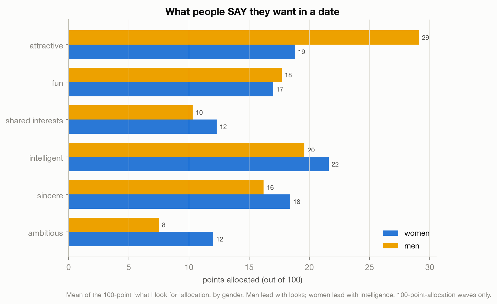
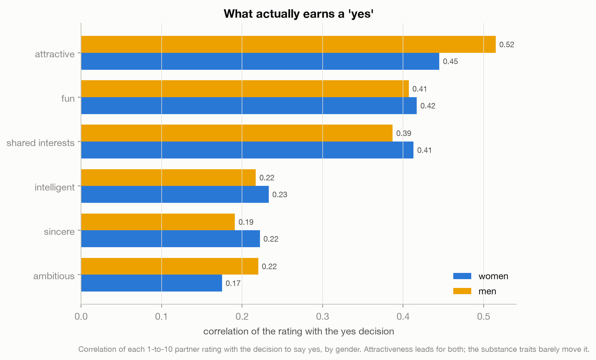
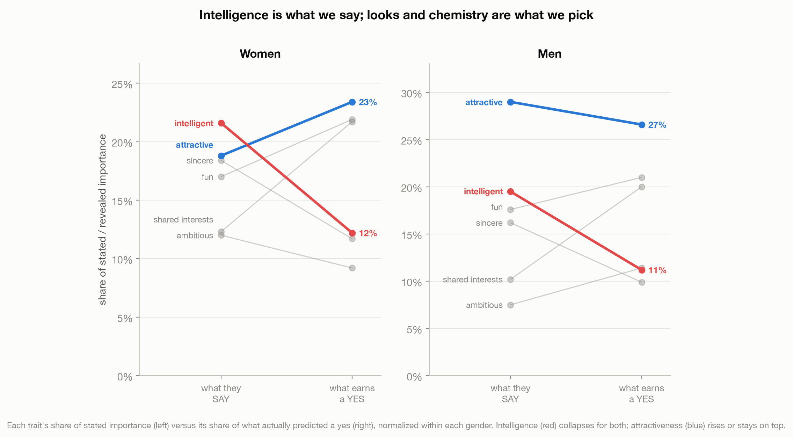

# Everyone Says Substance. Everyone Picks Chemistry.

> Speed daters rank intelligence and sincerity near the top of what they want in a partner.
> Minutes later, they hand out "yes" on the basis of something else. The list of what we
> want is mostly a costume; the choosing is the tell, and it is the same tell for men and
> women.

A data story about the Columbia speed dating experiment (Fisman et al., 2006), on the gap
between what people say they want in a partner and what actually earns their yes.
Live essay: [Everyone Says Substance. Everyone Picks Chemistry.](https://joechrisnaldy.com/blog/everyone-says-substance-everyone-picks-chemistry).

Data: [Speed Dating Experiment](https://www.kaggle.com/datasets/annavictoria/speed-dating-experiment)
(annavictoria), 8,378 date-level rows, 551 subjects, 21 waves.

---

## The story in three charts

**What people say.** Men put 29 of their 100 points on attractiveness; women lead with
intelligence (22) and rate ambition above men. The stereotype, confirmed in words.



**What earns a yes.** Attractiveness is the top predictor of a yes for both genders (men
0.52, women 0.45), with fun and shared interests right behind. The traits people put first
on their lists, intelligence and sincerity, sit near the bottom of what actually moves a
decision.



**The list is upside down.** Intelligence falls from women's #1 stated to #4 revealed, and
from men's #2 to #5. Everyone overstates it; attractiveness and chemistry climb. The
asymmetry: men lead with looks and looks is what wins (candid), women are expected to lead
with a mind, which is the trait that collapses hardest. Not that women are less honest, but
that the social script hands them a different line.



The transferable point reaches past dating: every survey, customer interview, and form gives
you the list, the presentable and slightly aspirational version of a person. What they do
with a real option in front of them is often something else. When the list and the choice
disagree, trust the choice.

---

## How the analysis works

| Step | Script | What it does |
|------|--------|--------------|
| 1. Profile | [`profile_data.py`](profile_data.py) | Shape, gender split, the stated and rating columns. |
| 2. Analyze | [`build_analysis.py`](build_analysis.py) | Stated allocation by gender (100-point waves), revealed correlation of each rating with the yes decision by gender, normalized shares, ranks, selectivity. Writes `results.json`. |
| 3. Charts | [`make_charts.py`](make_charts.py) | The three figures above. |

"What people say" is the mean 100-point "what I look for" allocation, on the 100-point waves
only (waves 6-9 used a 1-to-10 scale and are excluded). "What earns a yes" is the
correlation of each 1-to-10 partner rating with the decision, by gender. The third chart
normalizes each side to a share of importance within each gender.

## Reproduce it

```bash
python3 -m venv .venv && source .venv/bin/activate
pip install -r ../requirements.txt          # pandas, numpy, matplotlib
# download the data into data/ (see data/README.md); the CSV is latin-1 encoded
python build_analysis.py                    # writes results.json
python make_charts.py                        # writes charts/*.png
```

## Method and caveats

Full design and plan notes are in [`docs/`](docs/). In short: the "yes" association is a
correlation, not a causal weight (a logistic model gives the same ordering); the gap between
stated and revealed preference has at least two explanations this data cannot separate
(social performance and plain self-ignorance); and the sample is a specific population at a
specific time, Columbia graduate students around 2003, in a binary, opposite-sex-only
design. Nothing here is a law of attraction, and nothing is a claim about who anyone should
want.
