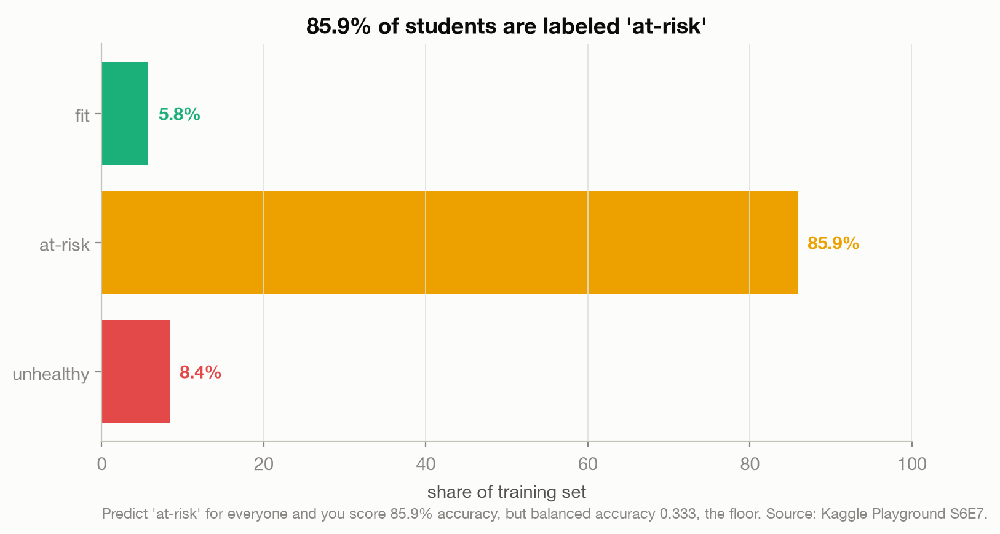
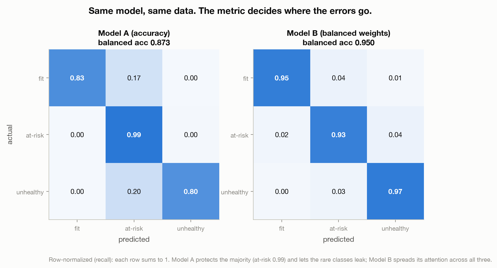
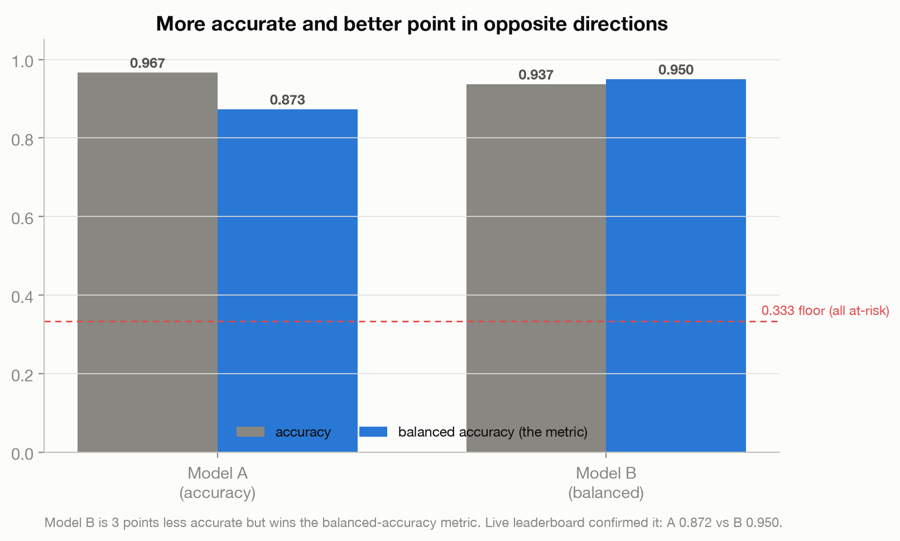
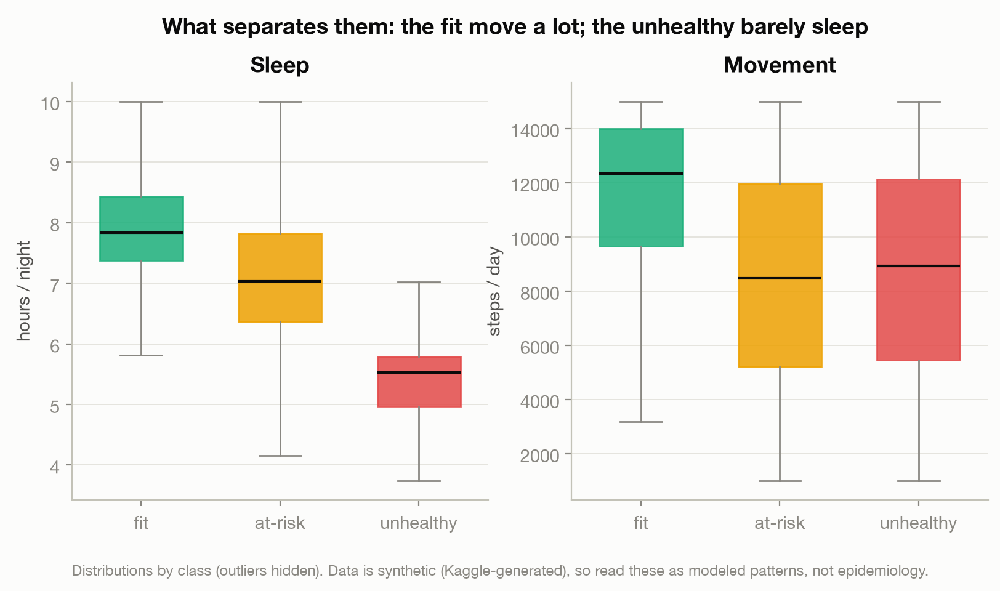
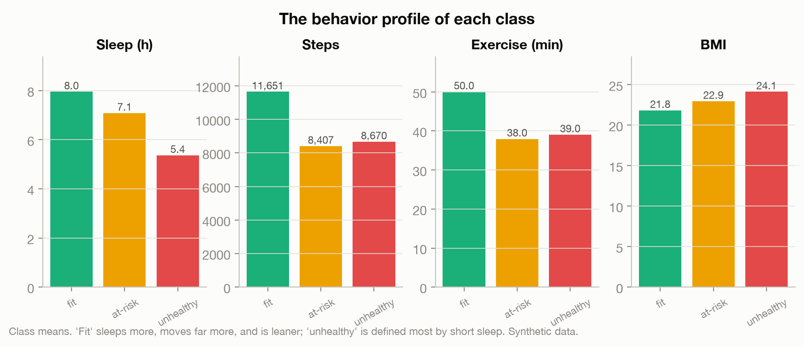

# A Model Can Be 86% Right and Useless

> A model that predicts "at-risk" for every student is 85.9% accurate and worthless. In this competition, a *less* accurate model wins. The reason is a single upstream decision almost nobody argues about: the metric.

This is a data story about [Kaggle Playground Series S6E7](https://www.kaggle.com/competitions/playground-series-s6e7), a 690,088-row task to sort college students into three health classes (`at-risk` 85.9%, `unhealthy` 8.4%, `fit` 5.8%). The competition scores on **balanced accuracy**, which weights every class equally, and that one choice changes what a "good" model even means.

**Read the full essay:** [joechrisnaldy.app/blog/a-model-can-be-86-percent-right-and-useless](https://joechrisnaldy.app/blog/a-model-can-be-86-percent-right-and-useless)
**See every step:** [`analysis` code below](#how-the-analysis-works)

---

## The story in five charts

**86% accurate is the floor, not the ceiling.** Predict the majority class for everyone and you score 85.9% accuracy but 0.333 balanced accuracy, the same as guessing.



**Two models, one difference.** Same gradient-boosted tree, same features, same settings. The only change is whether the rare classes are weighted up. Model A (accuracy) protects the majority and is careful about the tails; Model B (balanced) spreads its attention across all three. Read each row as the catch rate (recall) for that class.



**The leaderboard rewards the "worse" model.** Model B is three points less accurate (93.7 vs 96.7) yet wins the balanced-accuracy board, 0.950 to 0.872. "More accurate" and "better" point in opposite directions.



**What caring about the tails reveals.** Movement marks the fit (about 11,600 steps a day); short sleep marks the unhealthy (around five and a half hours). Notably, the unhealthy students are not sedentary, they walk about as much as the at-risk middle.




The takeaway, argued in full in the essay: the metric is a values choice, made by someone before you ever train a model, and it quietly decides which errors count. (Honest caveats in the essay: balanced accuracy is class-equity not harm-triage, Model B trades a big precision drop for its recall gains, and the data is synthetic.)

---

## How the analysis works

Two small scripts.

| Step | Script | What it does |
|------|--------|--------------|
| 1. Profile | [`profile_data.py`](profile_data.py) | The class imbalance, feature types, missingness, and the signal peek by class. |
| 2. Two models | [`model/train_models.py`](model/train_models.py) | Trains Model A and Model B (identical except class weights), reports accuracy / balanced accuracy / confusion matrices, writes both submissions and `results.json`. |
| 3. Charts | [`make_charts.py`](make_charts.py) | The five figures above, from `results.json` and the training data. |

The whole argument lives in one line of the model script: Model B passes `sample_weight="balanced"` to the exact same estimator as Model A. Everything else, the algorithm, the features, the hyperparameters, the validation split, is held identical, so the difference in behavior is attributable to that single instruction. See [`model/README.md`](model/README.md) for the model detail and how to submit.

## Reproduce it

```bash
python3 -m venv .venv && source .venv/bin/activate
pip install -r ../requirements.txt          # pandas, numpy, scikit-learn, matplotlib
# download the data into data/ (see data/README.md)
python profile_data.py
python model/train_models.py                 # writes model/results.json + submissions
python make_charts.py                        # writes charts/*.png
```

## Method and caveats

Full design and method notes: [`docs/2026-07-09-metric-values-design.md`](docs/2026-07-09-metric-values-design.md). In short: figures come from a single stratified 80/20 holdout that matched the live leaderboard almost exactly (no overfitting); the data is synthetic, so the behavioral separations are illustrative and probably reflect the label-generation recipe rather than real students; balanced accuracy weights all classes equally and ignores error costs, which is a modeling choice, not a universal truth.
