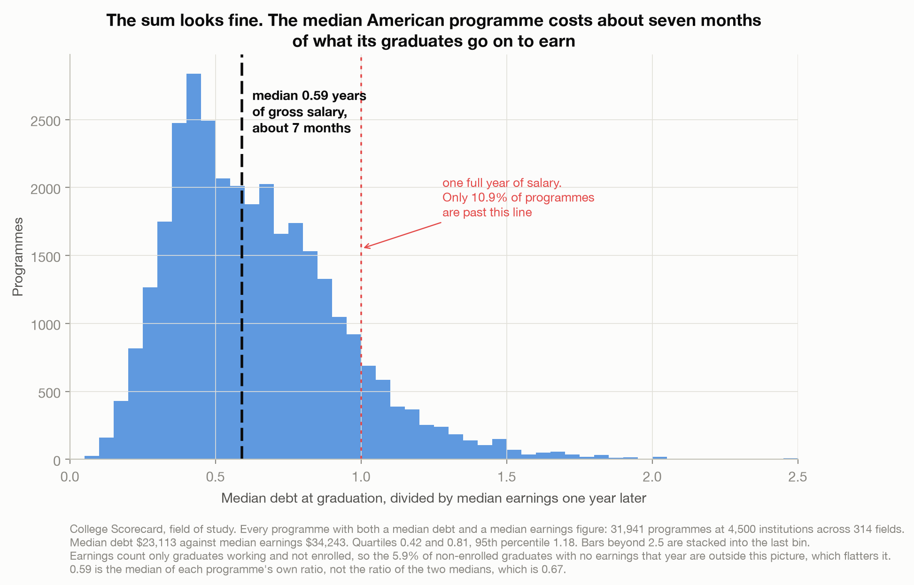
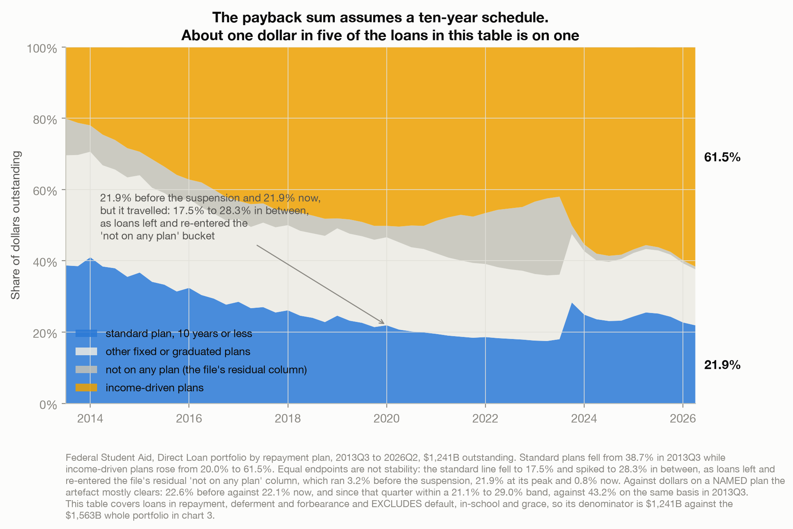
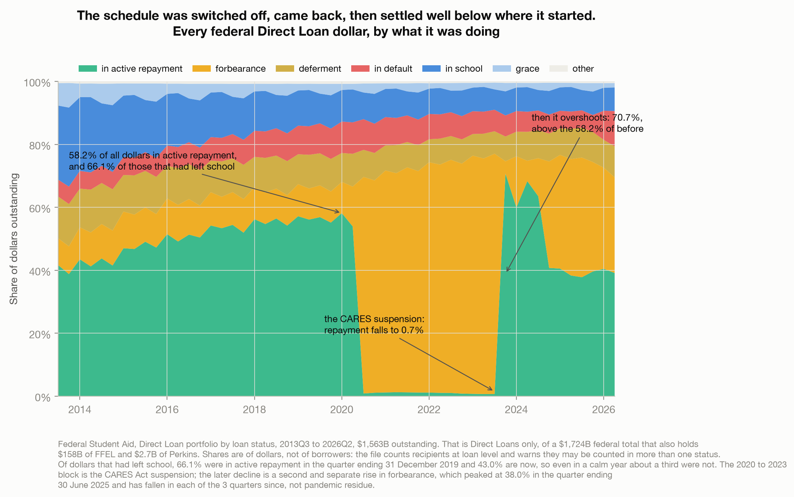
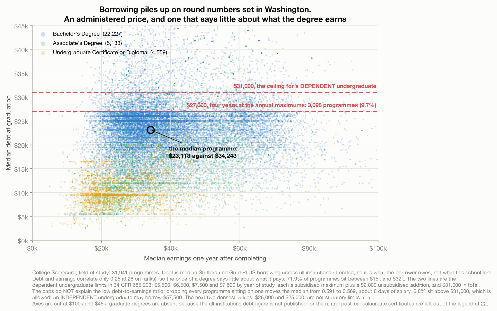

# The Payback Period Assumes You Are Paying It Back

> Divide a degree's median debt by its graduates' median earnings and you get the price of that
> degree in years of salary. Across 31,941 US programmes the median is 0.59, about seven months.
> That sum is correct. It is also a price, not a deadline, and it quietly assumes a ten-year
> repayment schedule that about one federal loan dollar in five is actually on.

A data story about the difference between what something costs and when you stop paying for it.
Built entirely on two US Department of Education sources, with nothing joined from anywhere else.
Found via Data Is Plural, 2020-12-02. See [`data/README.md`](data/README.md).

---

## The argument in four charts

**The sum looks fine.** Median debt is $23,113 and median earnings $34,243 one year out. The median
programme costs **0.59 years of gross salary**, about seven months. That figure is the median of each
programme's own debt-to-earnings ratio, not the ratio of those two medians, which is 0.67. Only
**10.9%** of programmes cost more than a single year of earnings. Even the most expensive field in
America by this measure, of the 153 with at least 25 programmes, is Dance at 1.11 years, with Drama
at 1.09 and Film at 1.04. The worst-priced fields still cost about a year of what they earn, though
about one programme in a hundred costs more than a year and a half.



**But the sum assumes a schedule.** The Department's own field-of-study documentation says its
monthly payment estimates "are based on a standard 10-year fixed payment plan", and warns in the
same paragraph that this is "only one of many payment plans available to borrowers". The same
department's quarterly portfolio file says **21.9% of the $1,241B in that table is on a standard
plan of ten years or less**, down from **38.7%** in 2013, while income-driven plans went from
**20.0% to 61.5%**. Note the denominator: $1,241B is every dollar in the table, including the $10.5B
the file itself lists as not on any plan. This is the load-bearing chart, but not because the two
endpoints match. They do, at 21.9% before the suspension and 21.9% now, and that is a coincidence:
in between the line fell to 17.5% and spiked to 28.3% as loans left and re-entered the file's "not
on any plan" bucket, which itself went 3.2% to 21.9% to 0.8%. Measured against the $1,230.5B on a
named plan the artefact mostly clears, 22.6% before against 22.1% now, and since that quarter that
series has run 21.1% to 29.0%, against 43.2% on the same basis in 2013. Either way, about one dollar
in five.



**And the schedule gets switched off.** Active repayment fell to **0.7%** of dollars in 2023 under
the CARES Act suspension, then recovered and overshot to a peak of **70.7%** in the quarter
ending 30 September 2023, above the **58.2%** of the last pre-suspension quarter, and has since
fallen back to 39.2% as forbearance rose a second time. That second episode is not a smooth climb
and is not still climbing: forbearance went 3.9%, 16.3%, 6.5%, 12.1%, 33.8% through 2024, peaked at
**38.0%** in the quarter ending 30 June 2025, and has fallen in each of the three quarters since, to
30.4% now. The share of dollars in active repayment has swung between 0.7% and 70.7% in six years,
driven both times from far above any individual borrower. Even setting all of it aside, in the calm
quarter ending 31 December 2019 **33.9% of dollars that had left school** were not in active
repayment.



**The price is an administered one.** Debt and earnings correlate only **0.25**, so an expensive
degree is barely more likely to be a lucrative one. Debt clusters on round federal numbers:
**$27,000 is the single most common median debt in the country**, at 3,098 programmes or about one
in ten, and it is exactly a dependent undergraduate's four annual maximums of $5,500, $6,500, $7,500
and $7,500 added up (34 C.F.R. § 685.203). But the caps do **not** explain the low ratio: dropping
every programme reporting exactly one of them moves the median from 0.591 to 0.569, about **eight
days** of salary, and 14.6% of programmes are above the four-year figure anyway.



---

## How the analysis works

| Step | Script | What it does |
|------|--------|--------------|
| 1. Analyze | [`build_analysis.py`](build_analysis.py) | Reads both FSA workbooks and the Scorecard field-of-study file, proves all five traps from the data, computes the price distribution and its robustness checks, the repayment-plan mix, the status series with its post-suspension recovery path, and the borrowing-cap clustering with a test of whether the caps actually move the ratio, then writes `results.json`. |
| 2. Charts | [`make_charts.py`](make_charts.py) | The four figures above. Every figure derived from the data is interpolated from `results.json`. Typed literals are limited to chosen thresholds, axis limits, layout coordinates, plan names, and statutory constants quoted from 34 C.F.R. § 685.203. Three rounds of checking each found a hardcoded label that had gone stale, most recently a date and a row count, so treat any blanket guarantee here with suspicion and grep the captions yourself. |

## Reproduce it

```bash
python3 -m pip install pandas numpy matplotlib xlrd openpyxl
# download the source files, see data/README.md
python build_analysis.py                      # writes results.json
python make_charts.py                         # writes charts/*.png
```

## Method and caveats

**Five traps, all in the packaging rather than the data.** Full detail in
[`data/README.md`](data/README.md).

| Trap | What it does if ignored | Handling |
|---|---|---|
| Recipient counts are loan-level and repeat across statuses | summing them double counts people | every portfolio share is a share of dollars outstanding |
| The two FSA tables have different denominators, $1,563B against $1,241B | mixing them yields a percentage of nothing | the two series are reported separately, never combined |
| The 2020 to 2023 payment suspension | a recent quarter reads as a trend | full series plotted, pre-suspension baseline quoted, plan mix used for the structural claim |
| `_ANY_` and `_EVAL_` debt look like undergraduate and graduate | using `_ANY_` silently drops master's rows | they mean all-institutions and this-institution; `_ANY_` used, coverage stated, `_EVAL_` reported as a check |
| Earnings count only graduates who are working | the price looks better than it is | the 5.9% with no earnings is reported in the post |

**Federal fiscal quarters are not calendar quarters.** The fiscal year begins 1 October, so Q4 ends
30 September. An earlier version of this analysis treated fiscal 2019 Q4 as the last quarter before
the suspension; it is a September 2019 snapshot, five months early. Everything pre-pandemic here is
fiscal 2020 Q1, ending 31 December 2019.

**Direct Loans only.** Both FSA tables cover the Direct Loan portfolio, $1,562.9B of a $1,723.9B
federal total that also holds $158.3B of FFEL and $2.7B of Perkins.

**Different cohorts, and no like-for-like robustness check.** The Department's cohort map assigns the
debt to AY2018-19 and AY2019-20 leavers and the one-year earnings to AY2016-17 and AY2017-18 leavers,
so the ratio pairs different people. The two-year earnings column is a third cohort again, which is
why it cannot check the headline. The this-institution debt figure gives 0.577 against 0.591, but on
undergraduate rows alone it is 0.541, so it is a different measure landing nearby rather than
confirmation.

**Almost entirely undergraduate.** The all-institutions debt figure is published for no graduate
credential: not master's, doctoral or first-professional degrees, and not graduate or professional
certificates. The sample is bachelor's degrees, associate degrees and undergraduate certificates,
plus the post-baccalaureate certificate, the one credential above a bachelor's that does carry the
figure, contributing 22 programmes.

**Not a return on investment.** Scorecard observes people who finished a programme and later had a
job. There is no comparison group and nothing here identifies whether the degree caused the earnings.

**Not a policy argument.** Income-driven repayment and its forgiveness clause appear because they are
the mechanism that breaks the ten-year assumption. The tradeoff is named once, neutrally: a lower
payment now against a longer or forgiven balance later. Cancellation, the courts and any
administration are deliberately out of scope.

**This is not a criticism of the Department.** It publishes the payback inputs, states the ten-year
assumption in its own documentation and warns there that other plans exist, and publishes the
portfolio file that shows how few people are on it. Every figure here came from documents it released
to be read. The argument is about what survives the trip from those documents into use.
