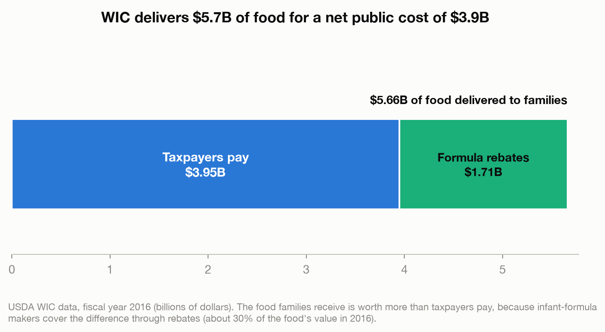
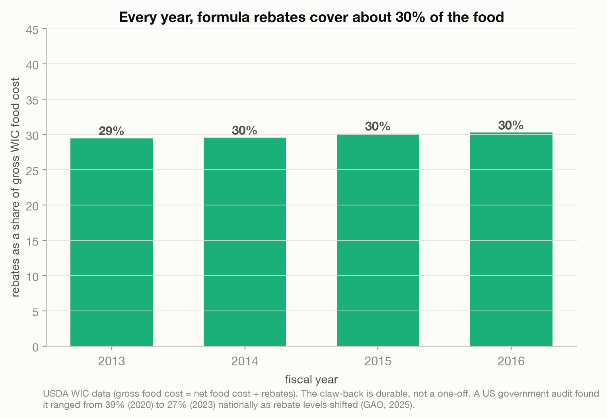
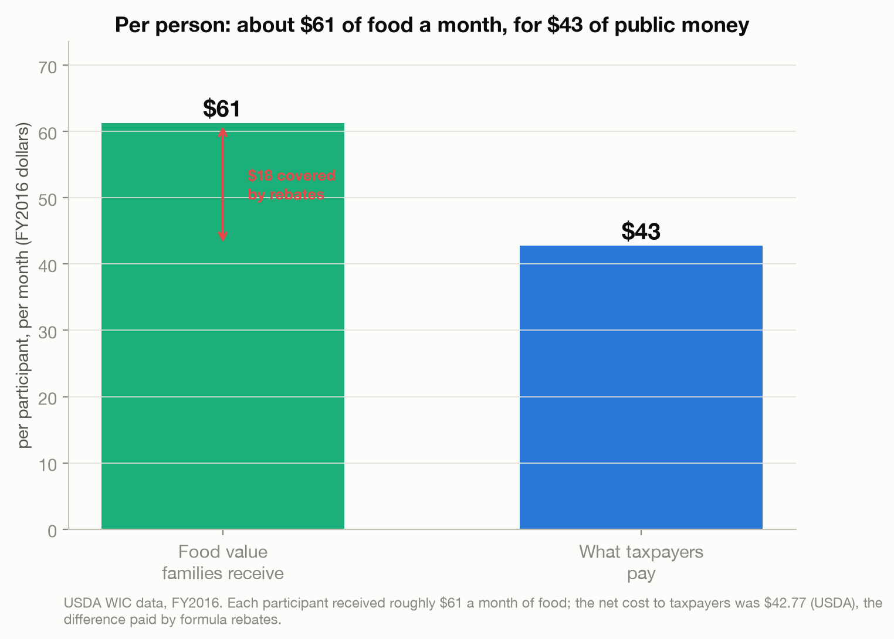
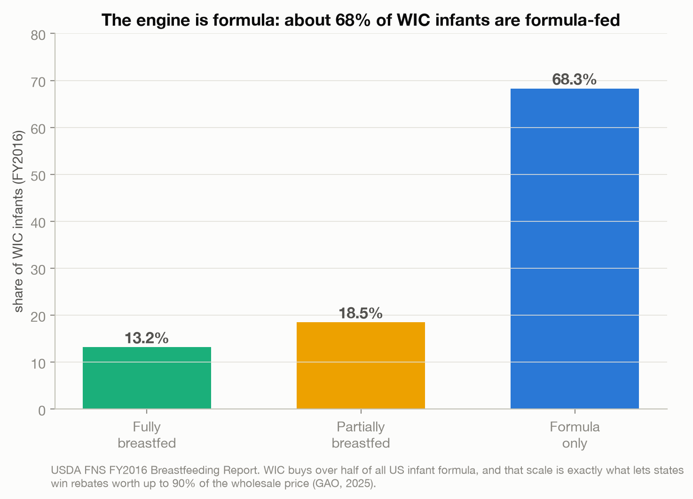

# The Benefit That Costs Less Than It Delivers

> A US food program for mothers and young children hands families more groceries than taxpayers pay
> for. The gap is covered by infant-formula makers, who compete to be the one brand WIC buys and pay
> large rebates to win. The benefit is bigger than its budget line.

A data story on the quiet economics of WIC (the Special Supplemental Nutrition Program for Women,
Infants, and Children). Objective and descriptive, not policy advocacy. Every number is reconciled
against USDA's published national totals.

Live essay: [The Benefit That Costs Less Than It Delivers](https://joechrisnaldy.com/blog/the-benefit-that-costs-less-than-it-delivers).

Data: [US Public Food Assistance - WIC](https://www.kaggle.com/datasets/jpmiller/publicassistance)
(USDA FNS administrative tables, FY2013-2016). Verified sources in
[`docs/`](docs/2026-07-19-wic-benefit-design.md); see [`data/README.md`](data/README.md) for the
reconciliation notes.

---

## The argument in four charts

**The rebate wedge.** In FY2016, WIC delivered about $5.7B of food to families, but the net cost to
taxpayers was only $3.95B. Infant-formula rebates covered the $1.7B difference, roughly 30% of the
food's value.



**A durable mechanism.** The claw-back is not a one-off: rebates covered about 30% of WIC's gross food
cost every year from 2013 to 2016. A US government audit (GAO, 2025) found it ranged from 39% (2020)
to 27% (2023) nationally as rebate levels shifted.



**What a family gets.** Per participant, WIC provided roughly $61 a month of food while the net cost
to taxpayers was $42.77 (USDA). The roughly $18 gap is paid by the rebate.



**The engine is formula.** The savings ride on scale: about 68% of WIC infants are formula-fed
(13.2% fully breastfed, 18.5% partially, FY2016), and WIC buys over half of all US infant formula.
That volume is exactly what lets states win rebates worth up to 90% of the wholesale price.



How does WIC get the rebate? Each state runs a competitive bid and awards a single manufacturer an
exclusive contract to be the only formula WIC provides there. Manufacturers bid huge discounts to win
the whole state. Descriptive analysis, not policy advice.

---

## How the analysis works

| Step | Script | What it does |
|------|--------|--------------|
| 1. Analyze | [`build_analysis.py`](build_analysis.py) | Loads the WIC tables, drops the regional subtotal + blank rows, treats `Food_Costs` as net, computes gross = net + rebates, the rebate share of gross, per-person values, and the breastfeeding split. Writes `results.json`. |
| 2. Charts | [`make_charts.py`](make_charts.py) | The four figures above. |

The cleaned totals match USDA national figures (FY2016 participation 7.70M, net food cost $3.95B,
rebate $1.72B, net food cost per person $42.77).

## Reproduce it

```bash
python3 -m venv .venv && source .venv/bin/activate
pip install -r ../requirements.txt          # pandas, numpy, matplotlib
# download the data into data/ (see data/README.md)
python build_analysis.py                     # writes results.json
python make_charts.py                         # writes charts/*.png
```

## Method and caveats

Full design and verified sources are in [`docs/`](docs/). Data covers FY2013-2016; the essay adds
current USDA figures (FY2024) for context. Two reconciliation steps are essential: exclude the FNS
regional subtotal rows, and treat the dataset's `Food_Costs` as net of rebates (gross = net +
rebates). The rebate mechanism, the ~90% wholesale rebate, the "over half of US formula" figure, and
the breastfeeding rates are verified against USDA FNS and GAO (GAO-25-106503). Everything is
descriptive administrative data; nothing here argues for or against the program.
