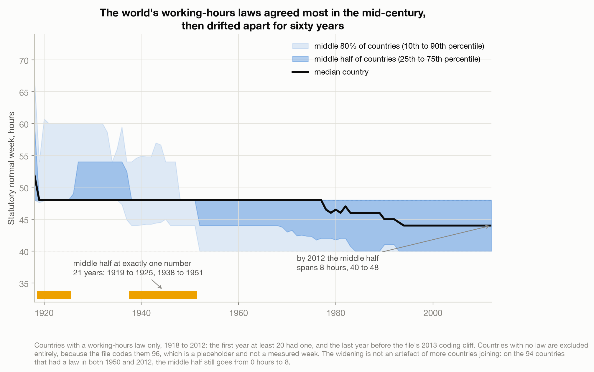
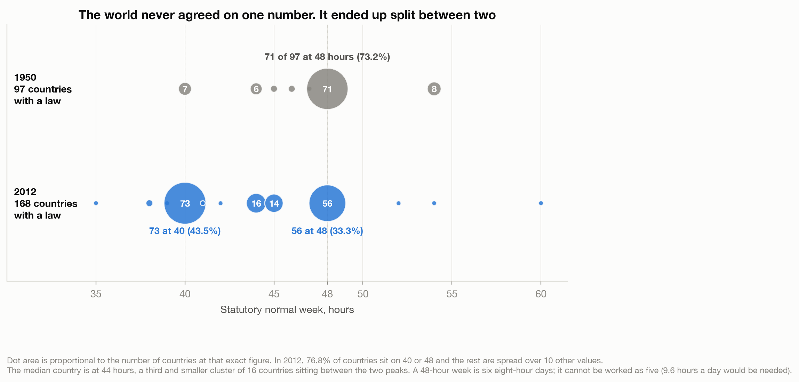
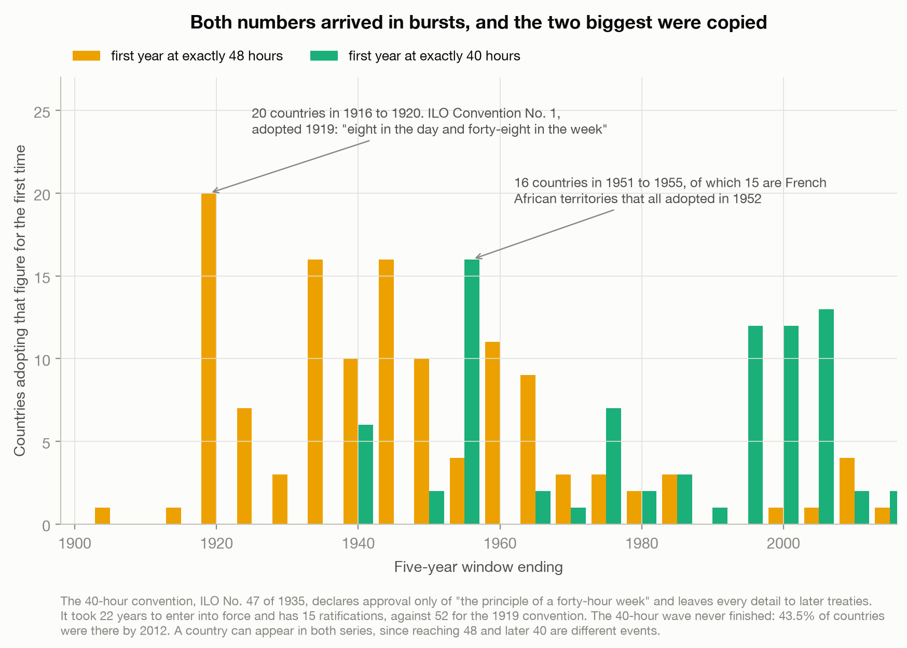
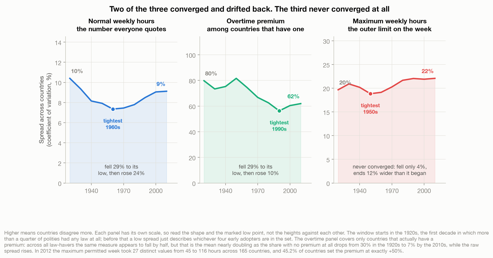

# A Third of the World's Labour Laws Still Assume You Work Saturday

> Forty hours is five eight-hour days. Forty-eight is six. In 2012, 56 of the 168 countries with a
> working-hours law had set their **normal** week at 48. The world's labour codes agreed most closely
> in 1949 and 1950 and have never come that close since, and the number that standardised is not the number
> that sets the outer limit.

A data story about 223 years of coded working-time regulation, built on Magnus Bergli Rasmussen's
hand-coded Working Time Regulation Dataset. Found via Data Is Plural, 2021-12-22. See
[`data/README.md`](data/README.md).

Live essay: [A Third of the World's Labour Laws Still Assume You Work Saturday](https://joechrisnaldy.com/blog/labour-laws-still-assume-you-work-saturday).

---

## The argument in four charts

**Agreement peaked and then reversed.** For 21 years, in two stretches running 1919 to 1925 and 1938
to 1951, the interquartile range of the statutory normal week was exactly zero: the middle half of
every legislating country sat on the same figure to the hour. The tightest years were 1949 and 1950, identical in this file, at a
coefficient of variation of 6.22% across 97 countries, and **no year since 1951 has matched it**; the
best in sixty years is 1967 at 7.13%, against 9.16% in 2012. Not an artefact of a growing set: on the
94 countries holding a law in both 1950 and 2012 the standard deviation still rises 2.99 to 3.82 and
the CV 6.29% to 8.82%, and the widening also holds on the 110-country panel from a 1960 baseline.
Meanwhile the mean fell in every decade from the 1920s to the 2010s, 50.5 to 43.7, so the headline
gave no warning.



**The world never agreed on one number; it split between two.** In 1950, 71 of 97 countries were at
48. In 2012, 73 are at 40 and 56 at 48, which is 76.8% on one of two values split almost evenly. The
median country sits at 44, which is not a gap but a third and smaller cluster of 16, with 14 more at
45.



**Both numbers were copied.** Twenty countries first set exactly 48 hours between 1916 and 1920, the
window containing ILO Convention No. 1, which required no more than "eight in the day and forty-eight
in the week". That is the tallest bar but not the biggest wave: on free five-year windows the largest
cluster of first-time 48-hour adoptions is the five years from 1945, with 24. The largest single year
in the file is 1952, when 15 French African territories adopted 40 hours at once. The 40-hour
convention of 1935 approved only "the principle" and deferred every detail; it took 22 years to enter
into force and has 15 ratifications against the 1919 convention's 52.



**Only one of the three instruments was never standardised.** From the 1920s to the 2010s the spread
of normal hours fell 29.3% to a 1960s low then rose 24.0%. The overtime premium fell 29.4% to a 1990s
low among countries that have one, then rose 10%, with 45.2% of all law-havers, and 48.7% of those
that have a premium, settling on exactly plus 50%. The **maximum permitted week never converged**: it fell 4.2%, which is noise, and ends 12% wider
than it began, spanning 27 distinct values from 45 to 116 hours across 165 countries.



---

## How the analysis works

| Step | Script | What it does |
|------|--------|--------------|
| 1. Analyze | [`build_analysis.py`](build_analysis.py) | Loads the Stata file, proves both coding traps from the data rather than asserting them, cuts at 2012, computes yearly and decade dispersion, the balanced-panel robustness checks, the 1948/1950/2012 distributions, the adoption waves on both fixed bins and free windows, the three-instrument comparison, and a reproduction of the paper's Table 3. Writes `results.json`. |
| 2. Charts | [`make_charts.py`](make_charts.py) | The four figures above, every label interpolated from `results.json` so a rerun cannot leave a stale number behind. |

## Reproduce it

```bash
python3 -m venv .venv && source .venv/bin/activate
pip install -r ../requirements.txt pyreadstat
# download the Stata file, see data/README.md
python build_analysis.py                      # writes results.json
python make_charts.py                         # writes charts/*.png
```

## Method and caveats

**Two coding traps govern everything here.** Both were found before any chart was drawn, and both
hand you a publishable-looking false headline.

| Trap | What it produces if ignored | Handling |
|---|---|---|
| `normalhours = 96` codes "no law", matching `workinglaw == 0` across 14,824 rows with zero exceptions, 55% of populated rows | a mean of 73.4 hours, and a fall from a 1920 base of 86.8 to 46.4 that is 90.6% composition | every hours figure computed on `workinglaw == 1` only |
| A coverage cliff at 2013: 70 countries lose maximum hours and 62 drop to a zero overtime premium in one year, while **zero** change their normal week | "a third of the world abolished overtime pay in 2013": 61 countries make that transition in 2013 against at most one in any earlier year | the whole analysis cut at 2012 |

**The paper's own convergence statistic includes the placeholder.** Table 3 of Rasmussen (2024)
reports the standard deviation of normal hours falling from 23.68 in 1940 to 9.64 in 2010. That series
reproduces here to a maximum absolute error of 0.032 across all thirteen published years when computed
over every polity carrying a COW code **with the 96 no-law value included**. On countries holding a
law it does not reproduce at all, and runs 4.68, 2.96, 3.99 for 1940, 1950 and 2010: down, then up.
This is not presented as an error. Treating an unregulated week as 96 is coherent and it measures the
spread of regulation, which is the paper's subject. It is a different question from whether the
countries that regulate agree with each other.

**The yearly series is the one quoted.** Chart 1 plots years, so the essay quotes years: tightest 1949
and 1950, tied at 6.22%, never matched after 1951, on the condition that at least twenty countries
had a law. The decade-pooled minimum is the 1960s, later than the yearly
minimum because decade pooling absorbs the 1952 adoption wave. Among decades with at least twenty polity-years the 1890s have the
lowest spread, but the 1840s to 1860s are lower still at exactly zero, because France is the only
polity with a law and sits at 72 hours every year. Even the 1890s figure rests on **four** polities,
all European: Austria, France, Russia and Switzerland, across 33 polity-years. Chart 1 starts at 1918, the first year at least 20 countries had
a law.

**Baseline choice was load-bearing and the obvious choice was unusable.** The composition
decomposition is anchored at 1920 and holds between 84.5% and 96.7% across both orderings. Anchored at
1850 it swings from 45.6% to 99.3%, because in 1850 exactly one polity of 86 had a law. Likewise the
balanced-panel test is stated as measured *from the peak*: it holds from 1950 and 1960 baselines and
does not hold from pre-peak baselines such as 1930, where dispersion narrows, which is what "agreement
peaked in mid-century" means.

**The overtime premium needed the same discipline as normal hours.** Measured across all law-havers it
appears to converge 45.8%, which is a denominator effect: over that same window the share with no premium at all fell
from 30.1% to 5.6%, nearly doubling the mean, while the raw standard deviation *rose* 5%. Chart 4 plots the
honest version, the spread among countries that actually have a premium, which falls 29.4%.

**No superlative for the maximum week.** Its decade-pooled spread ends at 22.08% against 22.05% in the
1990s, a margin of 0.03 points, and at year level 2012 ranks 17th of 136, so it is not called a record.
The claim is only that it never converged and ends 12% wider than it began.

**The Saturday claim is arithmetic, and the convention supports it.** The dataset has no days-per-week
column. 48 hours cannot be worked as five eight-hour days, and 56 of 168 countries legislated 48 in
2012. Article 2(b) of the 1919 convention permits exceeding eight hours on some days when others are
shorter but caps the day at nine, so even under that provision five days reach only 45.

**The 1952 attribution is inference from a date.** Law n° 52-1322 of 15 December 1952 is verified to
exist and to have established a labour code across France's overseas territories. Its hours provision
is not: Legifrance returns 403 and the Gallica transcription of the original is incomplete.

**Statutory is not actual, and the spread is not a ranking.** The 2012 48-hour bloc contains Germany,
Ireland and the United Kingdom alongside Saudi Arabia, Bangladesh and Nepal, and 48 does not mean the
same thing in any two of them. German law fixes eight hours per *Werktag*, Monday to Saturday, so its
48 is explicitly six eight-hour days. Britain's is a 48-hour average across a reference period that an
individual worker may opt out of. The same file records their maximum permitted week as 60, 60 and 72.
The regulations coded are for industrial workers, not all employment.

**Reform counts.** 200 changes to a statutory normal week between 1904 and 2012 on consecutive coded
years, 187 cuts and 13 increases, median cut 4 hours. Six further diffs span a break in a country's own
coverage, including three Baltic states re-entering after half a century, and are excluded.

**This is not a takedown.** Both traps are a coding convention and an end-of-coverage boundary, not
errors, and none of this would have been possible if the author had not published a hand-coded
223-year panel as a straight download. What the piece asks for is a documented no-law code and a stated
last year of coverage.

## What the adversarial fact-check changed

Four refute-first lenses plus a completeness critic returned 51 non-confirmed verdicts, 8 of them HIGH.
The corrections that changed the argument rather than the wording:

| Claim as drafted | What the check found |
|---|---|
| "Nothing else in 231 years moves that fast" about the 1919 wave | False. A free five-year window from 1945 holds 24 first-time 48-hour adoptions against 20 in the 1916-1920 bin, and 1952 alone holds 15. The corrected version strengthens the argument: the three largest waves are all one treaty and two rounds of imperial legislation. |
| "He is right that it happened" about the paper's convergence | The paper's Table 3 reproduces only with the 96 placeholder included. On law-havers the statistic falls to 1950 and then rises. |
| "Doing something nobody else has done" | Overclaim. The CBR Labour Regulation Index covers 117 countries from 1970, and the paper itself claims only "more polities over a longer time than alternative datasets". |
| Overtime premium "fell 45.8%" | A coefficient-of-variation artefact. The raw spread rose 5%; the honest figure is 29.4% among countries that have a premium. |
| "48 really is the statutory ceiling" in Germany, Ireland and the UK | Contradicted the essay's own lede and the file, which records their maximum as 60, 60 and 72. |
| "All 33 are European early adopters" in the 1890s | Four polities, not 33. The 33 was polity-years. |
| "Only two change their normal week" across the 2013 cliff | Zero. A `NaN != NaN` bug in `build_analysis.py`, now fixed. |
| "A largest real move of 8, in 1945" | A stock difference, not a transition. Counting within-country moves, 2013 has 61 against at most one in any earlier year. |
| The median "stepped down to 44" | It held 48 for 59 years, then took 17 more and nine moves, two of them upward, to reach 44 in 1994. |
| The median at 44 sits "in the gap between the two peaks" | 44 is the third-largest cluster, 16 countries. |
| "206 reforms across two centuries ... ran out of pressure" | Six of the 206 span coverage gaps; and the 1990s is the peak reform decade, so the ratchet was still turning. |
